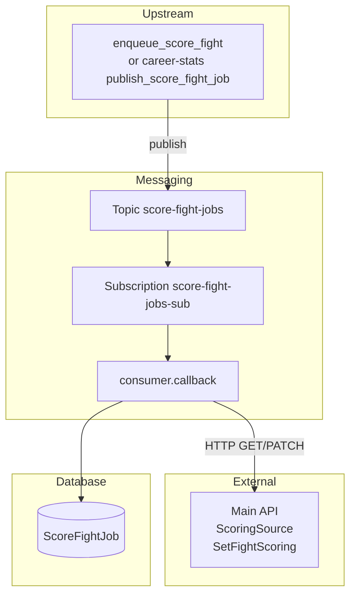

# Score Fight Worker (`score_fight`)

This feature consumes **Pub/Sub** messages with a completed `fight_id`, loads one scoreable snapshot of the fight through the main API, calculates fantasy round and fight scores in a pure scoring module, atomically persists the complete score state via API, and records each run in **`ScoreFightJob`**. It is the final stage of the pipeline; there is no downstream publish.

Upstream is the Career Stats Worker (`publish_score_fight_job` after its job is COMPLETED). Local testing uses `enqueue_score_fight` without waiting on that stage.

## Purpose

- Score every round and the full fight for both fighters on a completed fight (full replace, not incremental).
- Persist via pipeline-authenticated API endpoints (no fantasy ORM from the worker).
- Track job status in `score_fight_job` (`RUNNING`, `COMPLETED`, `RETRYING`, `FAILED`).
- Distinguish retryable incomplete inputs from permanently unscoreable outcomes (e.g. No Contest).

## Where This Lives

- Feature root: `backend/ufc_data_pipeline/fantasy/score_fight/`
- Job model: `backend/ufc_data_pipeline/models.py` (`ScoreFightJob`)
- API endpoints: `backend/api/urls.py` / `backend/api/views.py`
- Local enqueue command: `backend/fantasy/management/commands/enqueue_score_fight.py`
- Compose worker: `score-fight-worker` in `docker-compose.yml`

## Main Files

- `score_fight_worker.py` — process entry point; signal handling and consumer bootstrap.
- `consumer.py` — Pub/Sub subscriber, `_get_or_create_job` lifecycle, ack/nack rules, idle shutdown.
- `service.py` — orchestration: ScoringSource GET → pure scoring → SetFightScoring PATCH.
- `scoring.py` — pure calculation (no HTTP/ORM/Pub/Sub); also used by the legacy batch scripts.
- `api_client.py` — authenticated HTTP GET/PATCH to the main API; maps error codes to typed exceptions.
- `config.py` — subscription name, API base URL, retry cap, idle/concurrency settings.
- `tests/` — scoring, consumer, service, api client, idle shutdown, and worker entry tests.

## How It Works

- **Primary entry point:** `score_fight_worker.main()` → `run_subscriber()` in `consumer.py`.
- **Django bootstrap:** `ensure_django()` sets `DJANGO_SETTINGS_MODULE` to `ufc_fantasy.settings` before DB use.
- **Subscription:** `SubscriberClient.subscribe(..., flow_control=FlowControl(max_messages=MAX_MESSAGES))` on `score-fight-jobs-sub`. Default concurrency is 3 (`WORKER_MAX_MESSAGES`).
- **Idle shutdown:** Controlled by `WORKER_IDLE_SHUTDOWN_ENABLED` / `WORKER_IDLE_TIMEOUT_SECONDS` (via `worker_settings`). Compose sets shutdown **disabled** for local development.
- **Per-message `callback`:**
  - Parses JSON → `fight_id` (positive int). Bad payloads are **acked** (dropped).
  - `_get_or_create_job(fight_id)` inside `transaction.atomic()` + `select_for_update()` (plus a Postgres advisory lock keyed on `fight_id`):
    - If a **`RUNNING`** job already exists for the fight → return `None`, **ack** (skip duplicate in-flight work).
    - If a **`RETRYING`** job exists → promote it to `RUNNING`, return that row.
    - Otherwise (including when a prior **`COMPLETED`** or **`FAILED`** job exists) → create a **new** `RUNNING` job row.
  - `process_score_fight` → ScoringSource → `calculate_fight_scoring` → SetFightScoring.
  - Success → job `COMPLETED` (atomic) → **ack**.
  - **Unscoreable** failure (`ScoringSourceUnscoreableError` / `UnscoreableFightError`) → job `FAILED` immediately → **ack** (permanent; never redelivered).
  - Any other failure → increment `retry_count`; if `retry_count >= MAX_RETRY_COUNT` (3) → `FAILED` and **ack**; else `RETRYING` and **nack**.

## Pub/Sub contract

**Inbound** (`score-fight-jobs` / `score-fight-jobs-sub`):

```json
{"fight_id": 9350}
```

Published by the Career Stats Worker after its job commits `COMPLETED`, or locally by `enqueue_score_fight`. There is **no outbound topic**; this is the last pipeline stage.

## API endpoints used

| Step | Method / path | Effect |
|------|---------------|--------|
| 1 | `GET /api/fights/<fight_id>/ScoringSource` | Fight metadata plus both fighters' complete round stats |
| 2 | `PATCH /api/fights/<fight_id>/SetFightScoring` | Atomic full replace of `FightScore` + `RoundScore` for the fight |

Auth: `Authorization: Api-Key <PIPELINE_SERVICE_API_KEY>` (`HasAPIKey` / `IsPipelineService` on the views).

One GET and one PATCH per fight — no per-fighter or per-round calls. The write endpoint runs three bounded queries inside one transaction: resolve all `RoundStats`, bulk upsert scores, delete stale `RoundScore` rows.

**ScoringSource error contract** (mapped to typed exceptions in `api_client.py`):

| Status | `error_code` | Meaning | Worker behavior |
|--------|--------------|---------|-----------------|
| 409 | `SCORING_SOURCE_INCOMPLETE` | Fight not completed, or FightStats/RoundStats/finish details missing | `RETRYING` + nack (retryable) |
| 422 | `SCORING_SOURCE_UNSCOREABLE` | No-winner outcome outside the draw allowlist (e.g. No Contest) | `FAILED` + ack (permanent) |
| 404 | — | Fight does not exist | Generic failure → retry/exhaust |

Draws with methods `Decision - Split`, `Decision - Majority`, or `Draw` are scoreable (no winner bonuses); other null-winner outcomes are unscoreable.

## Data Flow

- **Input:** Pub/Sub message bytes with `fight_id`.
- **Processing:** API source → pure scoring → API atomic write.
- **Output (database):** `score_fight_job` row updates; fantasy `FightScore` / `RoundScore` via API.
- **Output (messaging):** none (final stage).



## External Dependencies

- **HTTP client:** `requests` in `api_client.py`.
- **Django ORM:** `ScoreFightJob` only (pipeline job table).
- **GCP Pub/Sub:** subscriber only (no publisher).

## Environment Variables

```text
PUBSUB_EMULATOR_HOST              # localhost:8085 on host; pubsub:8085 inside docker-compose
GOOGLE_CLOUD_PROJECT              # default local-project
PUBSUB_SCORE_FIGHT_TOPIC          # default score-fight-jobs (enqueue command)
PUBSUB_SCORE_FIGHT_SUBSCRIPTION   # default score-fight-jobs-sub
PIPELINE_API_BASE_URL             # http://web:8000 in Compose
PIPELINE_SERVICE_API_KEY
WORKER_IDLE_SHUTDOWN_ENABLED      # Compose sets false for local workers
WORKER_IDLE_TIMEOUT_SECONDS       # default 60
WORKER_IDLE_CHECK_INTERVAL_SECONDS
WORKER_MAX_MESSAGES               # default 3; concurrent Pub/Sub callbacks per worker
```

**Docker Compose overrides for `score-fight-worker`:**

```text
PUBSUB_EMULATOR_HOST=pubsub:8085
GOOGLE_CLOUD_PROJECT=local-project
PIPELINE_API_BASE_URL=http://web:8000
WORKER_IDLE_SHUTDOWN_ENABLED=false
WORKER_MAX_MESSAGES=3
```

## How to Run Locally

**Start worker (and dependencies):**

```bash
docker compose up --build score-fight-worker
```

`depends_on` waits for `pubsub-init` to finish creating topics/subscriptions (`score-fight-jobs` / `score-fight-jobs-sub` are already in the init script) and for `web` to start.

**Enqueue a test job (no Career Stats Worker required if FightStats/RoundStats already exist):**

```bash
docker compose exec web python manage.py enqueue_score_fight --fight-id 1
```

**Confirm success:**

- Worker logs: `Started score-fight job...`, `Completed score-fight job...`
- Job row `score_fight_job` status `COMPLETED` for that `fight_id`
- `FightScore` / `RoundScore` updated via API (check `web` access logs for the GET + PATCH pair)

## End-to-End Verification

Use a completed fight that already has two `FightStats` rows and complete
`RoundStats` rows. Replace `1` in both commands with that fight id.

```bash
docker compose up --build -d web pubsub pubsub-init score-fight-worker
docker compose exec web python manage.py enqueue_score_fight --fight-id 1
```

Wait for the worker's `Completed score-fight job` log, then run this assertion.
It verifies the terminal job state and that both fighters have fight and round
scores:

```bash
docker compose exec web python manage.py shell -c "from fantasy.models import FightScore, RoundScore; from ufc_data_pipeline.models import ScoreFightJob; fid=1; job=ScoreFightJob.objects.filter(fight_id=fid).latest('ran_at'); fight_fighters=set(FightScore.objects.filter(fight_id=fid).values_list('fighter_id', flat=True)); round_fighters=set(RoundScore.objects.filter(round_stats__fight_stats__fight_id=fid).values_list('round_stats__fight_stats__fighter_id', flat=True)); assert job.status == 'COMPLETED', job.status; assert len(fight_fighters) == 2, fight_fighters; assert len(round_fighters) == 2, round_fighters; print('PASS', job.status, fight_fighters, round_fighters)"
```

To verify the permanent-failure path, choose a completed No Contest /
`Could Not Continue` fight with a null winner and no existing scores. Replace
`2` below with that fight id:

```bash
docker compose exec web python manage.py enqueue_score_fight --fight-id 2
docker compose exec web python manage.py shell -c "from fantasy.models import FightScore, RoundScore; from ufc_data_pipeline.models import ScoreFightJob; fid=2; job=ScoreFightJob.objects.filter(fight_id=fid).latest('ran_at'); assert job.status == 'FAILED', job.status; assert not FightScore.objects.filter(fight_id=fid).exists(); assert not RoundScore.objects.filter(round_stats__fight_stats__fight_id=fid).exists(); print('PASS', job.status, job.error_msg)"
```

The worker should log the 422 `SCORING_SOURCE_UNSCOREABLE` response, mark the
job `FAILED`, ack the message, and never call `SetFightScoring`.

The automated integration coverage exercises the same contracts in-process:
enqueue payload → consumer → ScoringSource view → pure scorer →
SetFightScoring view → database rows → terminal job state.

```bash
docker compose exec web python manage.py test ufc_data_pipeline.fantasy.score_fight.tests.test_integration
```

## Common Errors / Gotchas

- **Wrong `PUBSUB_EMULATOR_HOST` in Docker:** Inside a container, `localhost:8085` does not reach the emulator. Use `pubsub:8085` (Compose override).
- **Missing `PIPELINE_SERVICE_API_KEY`:** `api_client` raises `PIPELINE_SERVICE_API_KEY is not configured`.
- **Incomplete source data:** A 409 `SCORING_SOURCE_INCOMPLETE` from ScoringSource is retryable — the consumer nacks and Pub/Sub redelivers until `MAX_RETRY_COUNT` (3) is exhausted, then the job is `FAILED`.
- **Unscoreable outcomes (No Contest etc.):** A 422 `SCORING_SOURCE_UNSCOREABLE` (or `UnscoreableFightError` from the pure module) is permanent — job `FAILED` on the first attempt and the message is acked, never redelivered.
- **Duplicate in-flight jobs:** Same-`fight_id` concurrency is blocked by the local claim lock + Postgres advisory lock + `select_for_update`; different fights can run up to `WORKER_MAX_MESSAGES` at once.
- **Reprocessing completed fights:** A prior `COMPLETED` job does **not** block a new run; a new job row is created and SetFightScoring overwrites idempotently (stale `RoundScore` rows are deleted).
- **Invalid JSON or non-positive `fight_id`:** Payload errors are **acked**; the message is dropped.

## Notes for Future Developers

- Ack/nack must be called from the subscriber `callback` thread.
- Persistence is API-only for fantasy tables; do not add direct ORM writes to `FightScore` / `RoundScore` from this worker.
- `scoring.py` must stay pure (no HTTP/ORM/Pub/Sub) — the legacy batch scripts in `backend/scripts/db_population.py` import its per-category functions.
- This is the terminal pipeline stage; if a downstream stage is ever added, publish only after the job row commits `COMPLETED` (see the career-stats consumer for the pattern).
