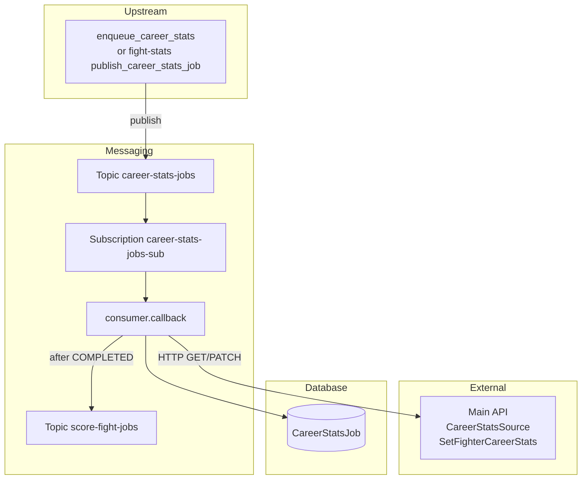

# Fighter career stats (`career_stats`)

This feature consumes **Pub/Sub** messages with a completed `fight_id`, loads both fighters’ completed FightStats histories through the main API, fully recalculates cumulative `FighterCareerStats` in a pure counters module, upserts each fighter via API, records each run in **`CareerStatsJob`**, and publishes a downstream **`score-fight-jobs`** message after success.

Upstream is the Fight Stats Scraper (`publish_career_stats_job`). Local testing uses `enqueue_career_stats` without waiting on that scrape.

## Purpose

- Recalculate career totals for both fighters on a triggering fight (full replace, not incremental).
- Persist via pipeline-authenticated API endpoints (no fantasy ORM from the worker).
- Track job status in `career_stats_job` (`RUNNING`, `COMPLETED`, `RETRYING`, `FAILED`) and ownership via nullable `lease_expires_at` (5-minute claim lease).
- Hand off to the Score Fight Worker via Pub/Sub after success.

## Where This Lives

- Feature root: `backend/ufc_data_pipeline/fighters/career_stats/`
- Job model: `backend/ufc_data_pipeline/models.py` (`CareerStatsJob`)
- API endpoints: `backend/api/urls.py` / `backend/api/views.py`
- Local enqueue command: `backend/fantasy/management/commands/enqueue_career_stats.py`
- Compose worker: `career-stats-worker` in `docker-compose.yml`

## Main Files

- `career_stats_worker.py` — process entry point; signal handling and consumer bootstrap.
- `consumer.py` — Pub/Sub subscriber, ack/nack rules, idle shutdown, score-fight publish after COMPLETED.
- `message_processor.py` — transport-agnostic claim + recalc + job status.
- `service.py` — orchestration: source GET → counters → career-stats PATCH; `publish_score_fight_job`.
- `counters.py` — pure recalc (no HTTP/ORM/Pub/Sub).
- `api_client.py` — authenticated HTTP GET/PATCH to the main API service.
- `config.py` — topic/subscription names, API base URL, score-fight topic, `MAX_MESSAGES`.
- `tests/` — counters, consumer, service, idle shutdown, and score-fight publish tests.

## How It Works

- **Primary entry point:** `career_stats_worker.main()` → `run_subscriber()` in `consumer.py`.
- **Django bootstrap:** `ensure_django()` sets `DJANGO_SETTINGS_MODULE` to `ufc_fantasy.settings` before DB use.
- **Subscription:** `SubscriberClient.subscribe(..., flow_control=FlowControl(max_messages=MAX_MESSAGES))` on `career-stats-jobs-sub`. Default concurrency is 3 (`WORKER_MAX_MESSAGES`).
- **Idle shutdown:** Controlled by `WORKER_IDLE_SHUTDOWN_ENABLED` / `WORKER_IDLE_TIMEOUT_SECONDS` (via `worker_settings`). Compose sets shutdown **disabled** for local development.
- **Per-message `callback`:**
  - Parses JSON → `fight_id` (positive int). Bad payloads are **acked** (dropped).
  - `claim_pubsub_job()` (shared helper) claims or creates `CareerStatsJob`:
    - New `RUNNING` rows set `lease_expires_at = now + 5 minutes`.
    - Unexpired `RUNNING` (another worker presumed to still own the job) → return `None`, **ack**.
    - Expired or null `RUNNING` is stale: reclaim **that same row**, refresh the 5-minute lease, bind the current `pubsub_message_id`, and **continue this Pub/Sub message**. A worker can crash after setting `RUNNING`; without a lease, later redelivery would skip and orphan the job.
    - `RETRYING` → reclaim the same row to `RUNNING` with a fresh lease.
    - Prior `COMPLETED` or `FAILED` (new message id) → create a **new** `RUNNING` job row.
  - `process_career_stats` → CareerStatsSource → counters per fighter → SetFighterCareerStats for each.
  - Success → job `COMPLETED` (atomic) → `publish_score_fight_job(fight_id)` **after** that commit → **ack**.
  - Failure → increment `retry_count`; if `retry_count >= MAX_RETRY_COUNT` (3) → `FAILED` and **ack**; else `RETRYING` and **nack**.

## Pub/Sub contract

**Inbound** (`career-stats-jobs` / `career-stats-jobs-sub`):

```json
{"fight_id": 9350}
```

**Outbound** (`score-fight-jobs`), published only after the job row is `COMPLETED`:

```json
{"fight_id": 9350}
```

## API endpoints used

| Step | Method / path | Effect |
|------|---------------|--------|
| 1 | `GET /api/fights/<fight_id>/CareerStatsSource` | Both fighters + completed FightStats histories |
| 2 | `PATCH /api/fighters/<fighter_id>/SetFighterCareerStats` | Full-replace upsert of cumulative career fields (per fighter) |

Auth: `Authorization: Api-Key <PIPELINE_SERVICE_API_KEY>` (`HasAPIKey` / `IsPipelineService` on the views).

The worker does **not** write fantasy tables via ORM; only `CareerStatsJob` is pipeline-owned ORM state.

## Data Flow

- **Input:** Pub/Sub message bytes with `fight_id`.
- **Processing:** API source → pure counters → API upserts.
- **Output (database):** `career_stats_job` row updates; fantasy `FighterCareerStats` via API.
- **Output (messaging):** publish `{"fight_id": ...}` to `score-fight-jobs` after COMPLETED.



## External Dependencies

- **HTTP client:** `requests` in `api_client.py`.
- **Django ORM:** `CareerStatsJob` only (pipeline job table).
- **GCP Pub/Sub:** subscriber + `publish_json` for score-fight handoff.

## Environment Variables

```text
PUBSUB_EMULATOR_HOST              # localhost:8085 on host; pubsub:8085 inside docker-compose
GOOGLE_CLOUD_PROJECT              # default local-project
PUBSUB_CAREER_STATS_TOPIC         # default career-stats-jobs
PUBSUB_CAREER_STATS_SUBSCRIPTION  # default career-stats-jobs-sub
PUBSUB_SCORE_FIGHT_TOPIC          # default score-fight-jobs
PIPELINE_API_BASE_URL             # http://web:8000 in Compose
PIPELINE_SERVICE_API_KEY
WORKER_IDLE_SHUTDOWN_ENABLED      # Compose sets false for local workers
WORKER_IDLE_TIMEOUT_SECONDS       # default 60
WORKER_IDLE_CHECK_INTERVAL_SECONDS
WORKER_MAX_MESSAGES               # default 3; concurrent Pub/Sub callbacks per worker
```

**Docker Compose overrides for `career-stats-worker`:**

```text
PUBSUB_EMULATOR_HOST=pubsub:8085
GOOGLE_CLOUD_PROJECT=local-project
PIPELINE_API_BASE_URL=http://web:8000
WORKER_IDLE_SHUTDOWN_ENABLED=false
WORKER_MAX_MESSAGES=3
```

## How to Run Locally

**Start worker (and dependencies):**

```bash
docker compose up --build career-stats-worker
```

`depends_on` waits for `pubsub-init` to finish creating topics/subscriptions and for `web` to start.

**Enqueue a test job (no Fight Stats Worker required if FightStats history already exists):**

```bash
docker compose exec web python manage.py enqueue_career_stats --fight-id 1
```

**Confirm success:**

- Worker logs: `Started career stats job...`, `Upserted career stats...`, `Published score-fight job...`
- Job row `career_stats_job` status `COMPLETED` for that `fight_id`
- `FighterCareerStats` updated via API (check `web` access logs for GET + paired PATCHes)
- Optional: pull `score-fight-jobs-sub` on the emulator to see `{"fight_id": ...}`

## Common Errors / Gotchas

- **Wrong `PUBSUB_EMULATOR_HOST` in Docker:** Inside a container, `localhost:8085` does not reach the emulator. Use `pubsub:8085` (Compose override).
- **Missing `PIPELINE_SERVICE_API_KEY`:** `api_client` raises `PIPELINE_SERVICE_API_KEY is not configured`.
- **Empty CareerStatsSource fighters:** Service raises if the source payload has no fighters (e.g. fight missing FightStats); consumer retries.
- **Duplicate in-flight jobs:** Same-`fight_id` concurrency is blocked by `select_for_update` job claims; different fights can run up to `WORKER_MAX_MESSAGES` at once.
- **Reprocessing completed fights:** A prior `COMPLETED` job does **not** block a new run; a new job row is created. An in-flight `RUNNING` job with an unexpired lease is skipped; an expired or null `RUNNING` lease is reclaimed on the same row by the current message.
- **Invalid JSON or non-positive `fight_id`:** Payload errors are **acked**; the message is dropped.
- **Score-fight publish timing:** Publish runs **after** the job `COMPLETED` commit, not inside that atomic block.
- **NC / draw rules:** NC methods with null result are excluded from tallies; null `winner_id` counts as a draw once NC is excluded.

## Notes for Future Developers

- Ack/nack must be called from the subscriber `callback` thread.
- Persistence is API-only for fantasy tables; do not add direct ORM writes to `FighterCareerStats` / `FightStats` from this worker.
- This stage only publishes `{"fight_id": ...}` to `score-fight-jobs`; scoring itself is handled by the Score Fight Worker (`backend/docs/data-pipeline/fantasy/score-fight.md`).
- Upstream Fight Stats Scraper should **publish** to `career-stats-jobs` only — it must not create `CareerStatsJob` rows.
