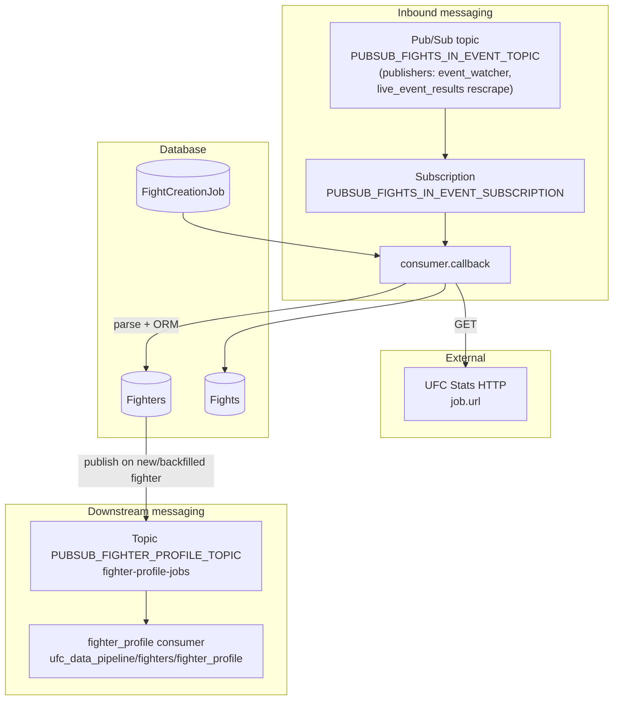

# Fights in event (`fights_in_event`)

This feature consumes **Pub/Sub** messages that point at a UFC Stats **event detail** page, downloads the HTML, parses fight rows and fighter links, upserts **`Fighters`** rows (by normalized name), bulk-inserts **`Fights`** rows for that event, and records each delivery in **`FightCreationJob`**. It is the downstream step after the **Event Watcher** publishes new events, and also after the **Live Event Results Watcher** republishes the same `{"url", "event_id"}` contract for card-change rescrapes (optional `reason` / `fingerprint` metadata). See related docs below.

When new fighters are created or an existing fighter receives a backfilled `profile_url`, it publishes `{fighter_id, fighter_url}` to the **`fighter-profile-jobs`** topic for the fighter profile worker. It does **not** create or update `FighterProfileScrapeJob` rows (see `backend/docs/data-pipeline/fighters/fighter-profile.md`).

## Purpose

- Turn “scrape this event page” jobs into persisted `Fights` (and supporting `Fighters` rows) for fantasy/pipeline use.
- Give each Pub/Sub message a durable **`FightCreationJob`** row keyed by `pubsub_message_id` for idempotency across retries.

## Where This Lives

- Feature root: `backend/ufc_data_pipeline/fights/fights_in_event/`
- Job model: `backend/ufc_data_pipeline/models.py` (`FightCreationJob`)
- Upstream publisher: `backend/ufc_data_pipeline/events/event_watcher/publisher.py` (new events) and `backend/ufc_data_pipeline/shared/fights_in_event_publisher.py` (Live Event Results card-change rescrapes)
- Related developer docs: `backend/docs/data-pipeline/events/event-watcher.md`, `backend/docs/data-pipeline/fights/live-event-results.md`

## Main Files

- `consumer.py` — Pub/Sub subscriber: payload parsing, HTTP fetch, `FightCreationJob` lifecycle, `scrape_fights_in_event`, `Fights` bulk create, ack/nack rules, `run_subscriber()` entry point and `__main__`.
- `parser.py` — `scrape_fights_in_event`, `ensure_fighters_exist`, row parsing helpers, and `_publish_fighter_profile_message` (Pub/Sub publish only for downstream fighter profile scraping).

## How It Works

- **Primary entry point:** `run_subscriber()` in `consumer.py`; module `__main__` calls it with logging configured.
- **Django bootstrap:** `ensure_django()` sets `DJANGO_SETTINGS_MODULE` to `ufc_fantasy.settings` and calls `django.setup()` before DB use.
- **Env guard:** `run_subscriber()` exits with a message if `GOOGLE_CLOUD_PROJECT` or `PUBSUB_FIGHTS_IN_EVENT_SUBSCRIPTION` is missing.
- **Idle shutdown:** Controlled by `WORKER_IDLE_SHUTDOWN_ENABLED` / `WORKER_IDLE_TIMEOUT_SECONDS`. Compose disables idle shutdown for local development.
- **Per-message `callback`:**
  - Parses JSON body → `url` (non-empty string) and `event_id` (int). Bad payloads are **acked** (dropped) after logging.
  - `claim_pubsub_job()` claims or creates `FightCreationJob` (`event_id` key, `pubsub_message_id` bound to the current delivery). New `RUNNING` rows get `lease_expires_at = now + 5 minutes`. Unexpired `RUNNING` → **ack** skip. Expired or null `RUNNING` reclaims **that same row** so this message continues processing (crash recovery; no heartbeat). `RETRYING` is reclaimed in place. `COMPLETED`/`FAILED` allow a new row. DB uniqueness races skip or nack per existing claim/`IntegrityError` handling.
  - If job already `COMPLETED` or `FAILED` → **ack** (no reprocessing).
  - Else: `fetch_soup(job.url)` → `scrape_fights_in_event(soup, job.event_id)` → in `transaction.atomic()`, optional `Fights.objects.bulk_create(fights)`, then job `COMPLETED`, `completed_at`, clear `error_msg` → **ack**.
  - On exception: increment `retry_count`, set `error_msg`; if `retry_count >= 3` → `FAILED` and **ack**; else `RETRYING` and **nack** (redelivery).
- **Parser path:** `scrape_fights_in_event` collects fight rows, builds unsaved `Fights` with `event_id`, `url` from `data-link`, `bout`, `weight_class`; calls `ensure_fighters_exist` which bulk-creates missing `Fighters`, bulk-updates `profile_url` when empty, and publishes fighter-profile Pub/Sub messages for new or backfilled fighters; returns pending `Fights` list (may be empty).

## Data Flow

- **Input:** Pub/Sub message bytes: JSON `{"url": "<event page>", "event_id": <int>}` (same shape produced by the Event Watcher when publishing).
- **Processing:** HTTP GET → BeautifulSoup → table rows → `Fighters` upsert logic → list of `Fights` → optional bulk insert.
- **Output (database):** `fight_creation_job` row updates; new/updated `fantasy_fighters`; new `fantasy_fights` rows when parse returns fights.
- **Output (messaging):** Publishes `{"fighter_id": <int>, "fighter_url": "<profile URL>"}` to `PUBSUB_FIGHTER_PROFILE_TOPIC` when:
  - a **new** fighter row is bulk-created and has a non-empty `profile_url`, or
  - an **existing** fighter had an empty `profile_url` and receives a backfilled URL from the event page.
  - Fighters that already have a `profile_url` are not re-published. See `ensure_fighters_exist` in `parser.py`.



## External Dependencies

- **HTTP:** `requests.get(url, timeout=60)` on the event page URL from the message (must be fetchable as given; relative URLs depend on what upstream publishes).
- **HTML parsing:** `beautifulsoup4`.
- **Django ORM:** `FightCreationJob`, `Fights`, `Fighters`, transactions, timezone.
- **GCP Pub/Sub (inbound):** `google.cloud.pubsub_v1.SubscriberClient` for the fights-in-event subscription.
- **GCP Pub/Sub (outbound):** `PublisherClient` in `_publish_fighter_profile_message` publishes `{fighter_id, fighter_url}` to `PUBSUB_FIGHTER_PROFILE_TOPIC` when new fighters need profile scraping.
- **Shared util:** `shared.utils.normalize_name` for fighter deduplication keys.

## Environment Variables

**Consumer (`consumer.py`):**

```text
GOOGLE_CLOUD_PROJECT
PUBSUB_FIGHTS_IN_EVENT_SUBSCRIPTION
```

**Fighter profile publish helper (`parser.py`):**

```text
GOOGLE_CLOUD_PROJECT
PUBSUB_FIGHTER_PROFILE_TOPIC
```

Example values for local emulator (from repo `.env` and `docker-compose.yml`):

```text
GOOGLE_CLOUD_PROJECT=local-project
PUBSUB_FIGHTS_IN_EVENT_SUBSCRIPTION=fights-in-event-sub
PUBSUB_FIGHTER_PROFILE_TOPIC=fighter-profile-jobs
PUBSUB_EMULATOR_HOST=localhost:8085   # host / IDE debugger
PUBSUB_EMULATOR_HOST=pubsub:8085      # inside docker-compose services
```

## How to Run Locally

- **Subscriber process:** `consumer.py` is runnable as a script (`if __name__ == "__main__"`). From the `backend` directory, ensure Django can import `ufc_fantasy` (usually cwd is `backend` on `sys.path`, or set `PYTHONPATH` to `backend`).

```bash
cd backend
python ufc_data_pipeline/fights/fights_in_event/consumer.py
```

Requires Django settings, database, valid GCP credentials for the subscriber client, and the env vars above. **Ask before running** if you are unsure about side effects (network, GCP, DB writes).

- **Unit tests:** `tests/test_parser.py` covers fight row parsing, winner resolution, and scrape behavior (with `_publish_fighter_profile_message` mocked).

## Common Errors / Gotchas

- **Invalid JSON or missing keys:** Payload errors are **acked**; the message is dropped (by design in `callback`).
- **Relative `url`:** If upstream sends a path-only URL, `requests.get` may fail unless the URL is absolute; behavior depends on the published payload.
- **`wc_td` indexing:** Parser uses `wc_td = wc_td[1]` after `find_all`; if fewer than two matching `td` elements exist, this can raise and drive retries/failure.
- **Debug `print` in `parser.py`:** None in current `ensure_fighters_exist` publish path; use logging if adding diagnostics.
- **Fighter profile downstream:** Consumer lives in `ufc_data_pipeline/fighters/fighter_profile/`; see `fighter-profile.md` for Playwright scraping, parser selectors, job claim leases (skip unexpired `RUNNING`; reclaim stale `RUNNING`; re-scrape allowed after `COMPLETED`), and Docker Pub/Sub host configuration.

## Notes for Future Developers

- Acking/Nacking **must** be called in the callback function or it may not be respected according to PubSub's official docs.
- Align **URL** publishing in the Event Watcher with what `requests.get` needs (absolute vs relative) if you see fetch failures in `fetch_soup`. The watcher normalizes listing hrefs to absolute UFC Stats URLs before publish.
- Required inbound fields remain `url` + `event_id`. Optional `reason` / `fingerprint` from Live Event Results are backward-compatible logging metadata and must not break consumers.
- Live Event Results never creates Fight rows itself; replacement recovery depends on this worker’s replay-safe upsert.
- Consider tests for `parse_message_payload`, `ensure_fighters_exist`, and `scrape_fights_in_event` similar to `events/shared/tests/test_parser.py`.
