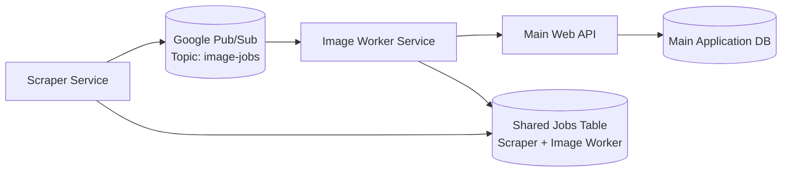
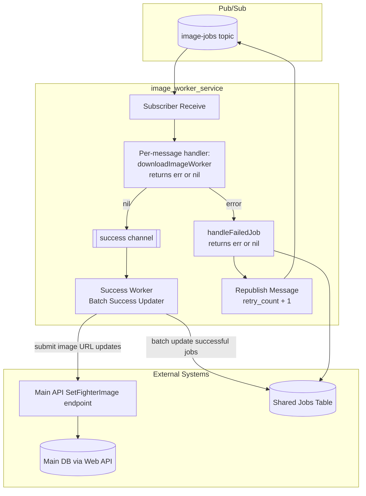

# Image Worker Service Architecture

This document explains how the `image_worker_service` works from multiple angles so PM, frontend, backend, and DevOps readers can quickly find the details they need.

## Table of Contents

- [1) Conceptual View](#1-conceptual-view)
- [2) Component View](#2-component-view)
- [3) Operational View](#3-operational-view)
- [4) Diagrams](#4-diagrams)
- [5) Technical Decisions and User Outcomes](#5-technical-decisions-and-user-outcomes)
- [6) Communication Flows](#6-communication-flows)
- [7) Why Pub/Sub](#7-why-pubsub)

## 1) Conceptual View

### What this service does

The `image_worker_service` processes fighter image jobs created by the scraper service. It retrieves image jobs, downloads/uploads image assets, and updates fighter image data through the web API.

### Business and user value

- Keeps fighter profiles visually up to date.
- Improves content quality in the product without manual image updates.
- Separates scraping from image processing so each part can scale independently.

## 2) Component View

### Core flow

1. The scraper service creates image jobs and publishes them to Pub/Sub topic: `image-jobs`.
2. `image_worker_service` listens to `image-jobs` and consumes job messages.
3. **Pub/Sub owns per-message concurrency**, not a separate pool of download goroutines started from `main`. The subscriber’s `Receive` handler runs the work for each message (up to `ReceiveSettings.MaxOutstandingMessages`, aligned with **10** in code). This matches Google’s guidance: **`Ack` / `Nack` happen inside the subscriber callback**, after processing finishes, so flow control and delivery semantics stay correct.
4. On success:
   - `downloadImageWorker` returns `nil`.
   - The job is sent on a success channel.
   - A dedicated success worker performs batch updates for successful jobs, reducing network/database calls.
   - The service submits image URL changes to the main system through the web API endpoint:
     - `path('api/fighters/<int:fighter_id>/SetFighterImage', views.AddFighterImageURL.as_view())`
   - The receive callback then **`Ack`s** the Pub/Sub message.
5. On failure:
   - `downloadImageWorker` returns a non-nil `error`.
   - The callback calls `handleFailedJob`, which also returns **`nil` or `error`**. If handling succeeds (DB update / republish as designed), the callback **`Ack`s** the original message so it is not redelivered as a duplicate. If `handleFailedJob` fails, the callback **`Nack`s** so the message can be retried.
   - Under the retry cap, the service republishes the payload with an incremented retry count and updates failure metadata in the shared jobs table; beyond the cap it marks the job dead in the shared table.

### Receive callback: work, return values, and `Ack` / `Nack`

There is **no per-job `Done` channel** and **no `Data` worker channel** for downloads. For each message the `Receive` callback:

1. Unmarshals the payload into `ImageJob` and attaches the Pub/Sub `Message` when needed for bookkeeping.
2. Calls **`downloadImageWorker`**, which returns **`nil` on success** or an **`error` on failure** (download/upload/API update failures).
3. **Branches on that return value:**
   - **`nil` from `downloadImageWorker`:** **`msg.Ack()`** (work succeeded).
   - **Non-nil from `downloadImageWorker`:** set `job.ErrorMsg`, call **`handleFailedJob`**; if that returns **`nil`**, **`msg.Ack()`**; if **`handleFailedJob`** returns **`error`**, **`msg.Nack()`**.
4. Invalid JSON: **`msg.Nack()`** in the callback (poison/dead-letter policy could **`Ack`** elsewhere; today the code **`Nack`s**).

Because the callback does the work and only then acknowledges, the client does not complete a message while work is still logically in flight on another goroutine you spawned yourself. Concurrency is bounded by **`MaxOutstandingMessages`** (set from the same **10** as `workerCount` in code).

### Boundaries

- Does **not** directly write fighter image data to the main application database.
- Uses the web API as the integration boundary for main DB changes.
- Does update a shared job-tracking table used by both scraper and image worker services.

## 3) Operational View

### Runtime model

- Service runs as a Go worker process.
- Consumes Google Pub/Sub messages from `image-jobs`.
- Uses **Pub/Sub `Receive` concurrency** (outstanding messages aligned with **10**) for parallel image jobs; each invocation runs **`downloadImageWorker`** and then **`Ack` / `Nack`** in the same callback.
- Uses in-process channels to coordinate:
  - Success batching worker (success channel only)
  - Failure handling path (invoked from the receive callback when `downloadImageWorker` returns an error)

### Deployment and scaling notes

- Horizontal scaling is supported by adding additional worker service instances.
- In-instance concurrency is controlled via worker count (currently **10**).
- Batch success updates reduce high-frequency network chatter under load.

## 4) Diagrams

### System Context Diagram

### Container / Internal Flow Diagram

Endpoint reference used by `image_worker_service` for fighter image updates:
`path('api/fighters/<int:fighter_id>/SetFighterImage', views.AddFighterImageURL.as_view())`

## 5) Technical Decisions and User Outcomes

| Requirement | Technical Choice | User Outcome |
|---|---|---|
| Throughput | **10** concurrent in-flight messages via Pub/Sub `Receive` (not a separate download worker pool) | Faster image processing and fresher fighter profiles. |
| Reduced network load | Success channel + batch success worker | Fewer update calls and better efficiency under load. |
| Reliability | Immediate failure handling + retry republish with incremented count | Temporary failures recover automatically with less manual intervention. |
| Data ownership boundaries | Update main fighter image data via web API endpoint, not direct DB writes | Safer integration and clearer ownership of main application data. |
| Ecosystem alignment | Google Pub/Sub (`image-jobs`) | Consistent platform usage with existing Google ecosystem and room to experiment. |
| Backpressure | `ReceiveSettings.MaxOutstandingMessages` aligned with worker count; processing and **`Ack` / `Nack`** in the subscriber callback | Pub/Sub flow control matches in-flight work; avoids orphaned or duplicate deliveries from ack timing drift. |

## 6) Communication Flows

### Frontend <-> Backend

- Frontend does not directly call this worker service.
- User-visible fighter image updates become available after worker processing and web API update completion.

### Backend <-> Backend

- **Scraper -> Worker (asynchronous):** via Pub/Sub topic `image-jobs`.
- **Worker -> Main Web API (synchronous request):** sends fighter image updates to:
  - `path('api/fighters/<int:fighter_id>/SetFighterImage', views.AddFighterImageURL.as_view())`
- **Worker/Scraper -> Shared Jobs Table:** both services update/read job state for tracking and retries.

### Failure and retry behavior

- When `downloadImageWorker` returns an error, the receive callback invokes **`handleFailedJob`**, which returns **`nil` or `error`**. The callback **`Nack`s** only if failure handling itself fails; otherwise it **`Ack`s** after a successful failure-handling path.
- Under the retry cap, the same logical job is republished with retry count incremented (and the original delivery is acked so it is not redelivered in parallel with the republish).
- This preserves payload consistency while enabling controlled retry attempts.

## 7) Why Pub/Sub

We use Google Pub/Sub because:

- It matches the existing Google ecosystem used by the project.
- It provides clean asynchronous decoupling between scraper and worker services.
- It allows experimentation with scalable event-driven job processing.

This keeps architecture simple, reliable, and easier to evolve as image volume grows.
