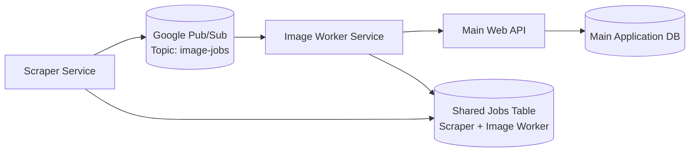
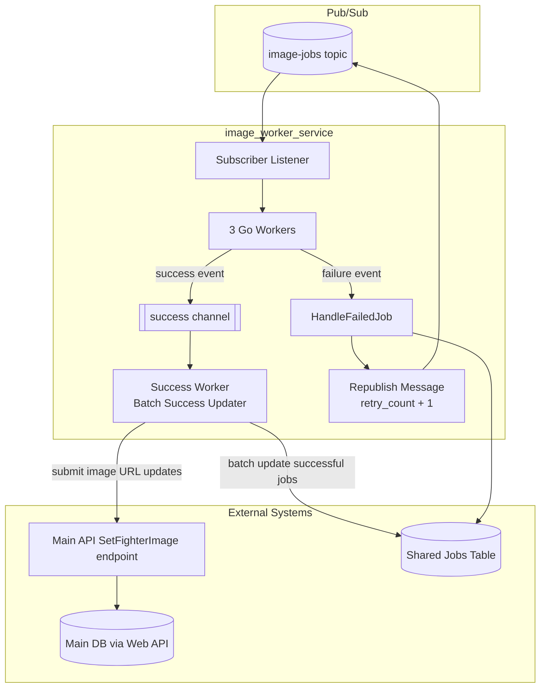

# Image Worker Service Architecture

This document explains how the `image_worker_service` works from multiple angles so PM, frontend, backend, and DevOps readers can quickly find the details they need.

## Table of Contents

- [1) Conceptual View](#1-conceptual-view)
- [2) Component View](#2-component-view)
- [3) Operational View](#3-operational-view)
- [4) Diagrams](#4-diagrams)
- [5) Technical Decisions and User Outcomes](#5-technical-decisions-and-user-outcomes)
- [6) Communication Flows](#6-communication-flows)
- [7) Why Pub/Sub](#7-why-pubsub)

## 1) Conceptual View

### What this service does

The `image_worker_service` processes fighter image jobs created by the scraper service. It retrieves image jobs, downloads/uploads image assets, and updates fighter image data through the web API.

### Business and user value

- Keeps fighter profiles visually up to date.
- Improves content quality in the product without manual image updates.
- Separates scraping from image processing so each part can scale independently.

## 2) Component View

### Core flow

1. The scraper service creates image jobs and publishes them to Pub/Sub topic: `image-jobs`.
2. `image_worker_service` listens to `image-jobs` and consumes job messages.
3. Worker goroutines process jobs concurrently (3 Go workers).
4. On success:
   - The job result is sent to a success channel.
   - A dedicated success worker performs batch updates for successful jobs, reducing network/database calls.
   - The service submits image URL changes to the main system through the web API endpoint:
     - `path('api/fighters/<int:fighter_id>/SetFighterImage', views.AddFighterImageURL.as_view())`
5. On failure:
   - The service immediately calls `HandleFailedJob`.
   - It republishes the same message payload with an incremented retry count.
   - It updates failure metadata in the shared jobs table.

### Boundaries

- Does **not** directly write fighter image data to the main application database.
- Uses the web API as the integration boundary for main DB changes.
- Does update a shared job-tracking table used by both scraper and image worker services.

## 3) Operational View

### Runtime model

- Service runs as a Go worker process.
- Consumes Google Pub/Sub messages from `image-jobs`.
- Uses 3 concurrent workers to improve throughput.
- Uses in-process channels to coordinate:
  - Job processing workers
  - Success batching worker
  - Failure handling path

### Deployment and scaling notes

- Horizontal scaling is supported by adding additional worker service instances.
- In-instance concurrency is controlled via worker count (currently 3).
- Batch success updates reduce high-frequency network chatter under load.

## 4) Diagrams

### System Context Diagram

### Container / Internal Flow Diagram

Endpoint reference used by `image_worker_service` for fighter image updates:
`path('api/fighters/<int:fighter_id>/SetFighterImage', views.AddFighterImageURL.as_view())`

## 5) Technical Decisions and User Outcomes

| Requirement | Technical Choice | User Outcome |
|---|---|---|
| Throughput | 3 concurrent Go workers | Faster image processing and fresher fighter profiles. |
| Reduced network load | Success channel + batch success worker | Fewer update calls and better efficiency under load. |
| Reliability | Immediate failure handling + retry republish with incremented count | Temporary failures recover automatically with less manual intervention. |
| Data ownership boundaries | Update main fighter image data via web API endpoint, not direct DB writes | Safer integration and clearer ownership of main application data. |
| Ecosystem alignment | Google Pub/Sub (`image-jobs`) | Consistent platform usage with existing Google ecosystem and room to experiment. |

## 6) Communication Flows

### Frontend <-> Backend

- Frontend does not directly call this worker service.
- User-visible fighter image updates become available after worker processing and web API update completion.

### Backend <-> Backend

- **Scraper -> Worker (asynchronous):** via Pub/Sub topic `image-jobs`.
- **Worker -> Main Web API (synchronous request):** sends fighter image updates to:
  - `path('api/fighters/<int:fighter_id>/SetFighterImage', views.AddFighterImageURL.as_view())`
- **Worker/Scraper -> Shared Jobs Table:** both services update/read job state for tracking and retries.

### Failure and retry behavior

- Failed jobs are handled immediately by `HandleFailedJob`.
- The same job message is republished with only retry count incremented.
- This preserves payload consistency while enabling controlled retry attempts.

## 7) Why Pub/Sub

We use Google Pub/Sub because:

- It matches the existing Google ecosystem used by the project.
- It provides clean asynchronous decoupling between scraper and worker services.
- It allows experimentation with scalable event-driven job processing.

This keeps architecture simple, reliable, and easier to evolve as image volume grows.
