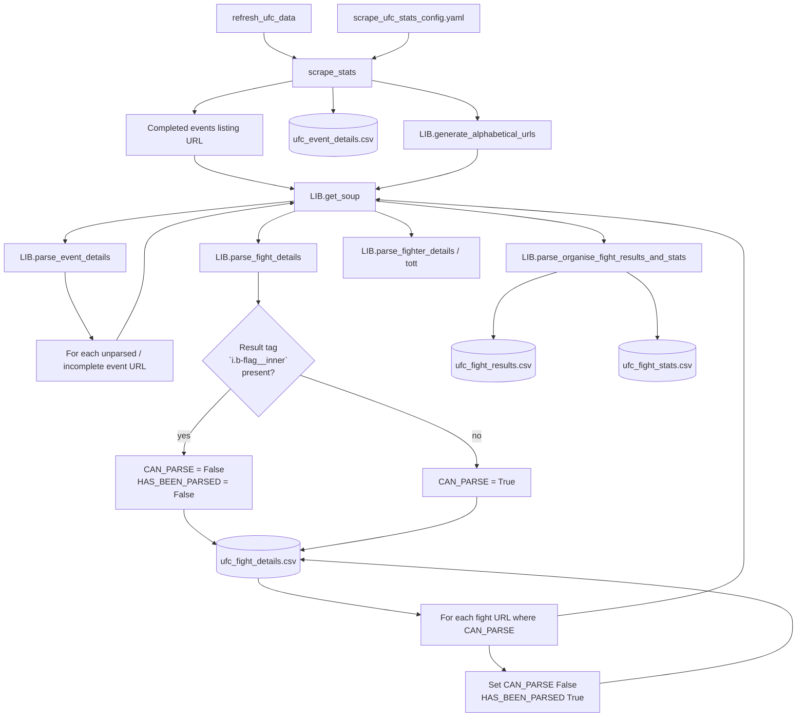
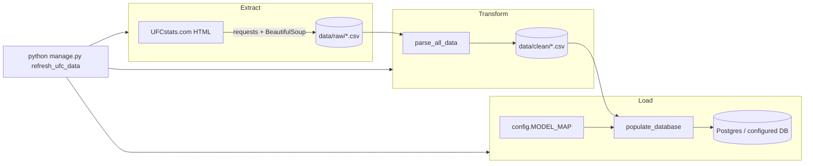

# UFC Data ETL — Scripts Layer

This document explains how raw UFCstats.com data is scraped, cleaned, and loaded into the Django database so PM, backend, and ops readers can follow the pipeline end to end.

## Table of Contents

- [1) Conceptual View](#1-conceptual-view)
- [2) Component View](#2-component-view)
- [3) Operational View](#3-operational-view)
- [4) Diagrams](#4-diagrams)
- [5) Technical Decisions and User Outcomes](#5-technical-decisions-and-user-outcomes)
- [6) Data and Command Flows](#6-data-and-command-flows)
- [7) Why This ETL Shape](#7-why-this-etl-shape)

## 1) Conceptual View

### What this layer does

The `scripts` package implements a **full ETL path**: **Extract** (HTTP scrape to CSV), **Transform** (parse and normalize into clean CSVs), **Load** (bulk upsert into Django models). Entry point is a Django management command that runs scrape → parse → populate in order.

### Business and user value

- Keeps fight cards, results, per-fight stats, and fighter metadata aligned with UFCstats without manual imports.
- Separates **network-heavy scraping** from **deterministic parsing** and **database writes**, so each stage can be reasoned about and rerun independently (from raw files).

## 2) Component View

### Entry: management command → `scrape_stats`

The pipeline is triggered by the custom Django command **`refresh_ufc_data`** (`fantasy/management/commands/refresh_ufc_data.py`). Its `handle()` method runs, in order:

1. `scrape_stats()` — `scripts/scrape/scrape_ufc_stats_unparsed_data.py`
2. `parse_all_data()` — `scripts/parse_data.py`
3. `populate_database()` — `scripts/db_population.py`

If you hear “refresh UFC stats” informally, this is that flow; the implemented command name is **`refresh_ufc_data`**.

### Scrape configuration (`scrape_ufc_stats_config.yaml`)

Paths and column schemas for scraper output live in `scripts/scrape/scrape_ufc_stats_config.yaml`, including:

- **`completed_events_all_url`** — listing page for completed events (`…/statistics/events/completed?page=all`).
- **Output CSV paths** under `data/raw/` (event details, fight details, fight results, fight stats, fighter details, fighter tale-of-the-tape).
- **Column name lists** for fight details (`CAN_PARSE`, `HAS_BEEN_PARSED`), fight results, totals, significant strikes, and fighter fields.

The scraper loads this file with `yaml.safe_load` at import time in `scrape_ufc_stats_unparsed_data.py`.

### `scrape_stats()` — high-level sequence

1. **Detect unparsed or incomplete events**  
   - Reads existing `ufc_event_details.csv`.  
   - Fetches the completed-events listing via **`LIB.get_soup`**.  
   - **`LIB.parse_event_details(soup)`** builds a fresh dataframe of all listed events (name, URL, date, location).  
   - Merges prior **`EVENT_STATUS`** from disk so status is preserved across runs.  
   - **Unparsed work** = events whose name is not yet in the saved file **or** whose `EVENT_STATUS` is still **`incomplete`** (e.g. card not fully finalized on the site).

2. **If there is work — event and fight rows**  
   For each URL of an unparsed/incomplete event:

   - **`LIB.get_soup(url)`** then **`LIB.parse_fight_details(soup)`**:
     - Walks each fight row (`tr` with `js-fight-details-click`).
     - **`event_complete`**: starts `True`; if a row is missing the result marker (`i.b-flag__inner`), that fight is treated as incomplete: the **event** is marked incomplete for this scrape, and that fight gets **`CAN_PARSE = False`** and **`HAS_BEEN_PARSED = False`** — meaning **not parsable** and **not yet parsed** for results/stats.
     - Rows with a result marker get **`CAN_PARSE = True`**, **`HAS_BEEN_PARSED = False`** until results are pulled.
   - Fight rows are merged by `URL`, and existing rows are updated in place via dataframe `update()` before concatenating truly new rows.

3. **Fight-level results and stats (only when `CAN_PARSE` is true)**  
   For each fight URL where **`CAN_PARSE`** is true:

   - **`LIB.parse_organise_fight_results_and_stats(...)`** orchestrates:
     - **`parse_fight_results` / `organise_fight_results`** — outcome, method, round, time, etc.
     - **`parse_fight_stats` / `organise_fight_stats` / `convert_fight_stats_to_df` / `combine_fighter_stats_dfs`** — per-round totals and significant strikes for both fighters.
   - Appends to `ufc_fight_results.csv` and `ufc_fight_stats.csv`.
   - Sets **`CAN_PARSE = False`**, **`HAS_BEEN_PARSED = True`** for fights that were just parsed (so they are not rescraped on the next run).

4. **Fighter directory and tale-of-the-tape**  
   - **`LIB.generate_alphabetical_urls()`** — one UFCstats URL per letter (`char=a` … `z`, `page=all`).  
   - For each letter page: **`LIB.parse_fighter_details`** → full union written to `ufc_fighter_details.csv`.  
   - **New fighter URLs** vs. previous file trigger **`LIB.parse_fighter_tott`** + **`LIB.organise_fighter_tott`** for missing profiles → **`ufc_fighter_tott.csv`**.

Supporting primitives in **`scripts/scrape/scrape_ufc_stats_library.py`** (order useful for reading the library):

| Function | Role |
|----------|------|
| `get_soup` | HTTP GET + BeautifulSoup parse |
| `parse_event_details` | Events index → dataframe |
| `parse_fight_details` | Per-event fight list, completion flag, `CAN_PARSE` / `HAS_BEEN_PARSED` |
| `parse_fight_results` | Raw list from fight page |
| `organise_fight_results` | List → one-row fight result dataframe |
| `parse_fight_stats` | Alternating fighter cells → two lists |
| `organise_fight_stats` | Group by fighter blocks |
| `convert_fight_stats_to_df` | Handles missing stats (NaNs) for old fights |
| `combine_fighter_stats_dfs` | Two fighters + EVENT/BOUT columns |
| `parse_organise_fight_results_and_stats` | Single entry for one fight URL |
| `generate_alphabetical_urls` | A–Z fighter listing URLs |
| `parse_fighter_details` | FIRST/LAST/NICKNAME/URL from listing pages |
| `parse_fighter_tott` / `organise_fighter_tott` | Tale of the tape + URL |
| `move_columns` | Column ordering helper |

### `parse_all_data()` — transform raw CSVs → `data/clean/`

`parse_all_data()` runs these parsers in order (`scripts/parse_data.py`):

1. **`parse_fighters`** — Joins fighter details + tale-of-the-tape + active fighter scrape; writes **`fighters_metadata_clean.csv`**.
2. **`parse_events`** — Event rows → typed dates/locations; **`event_data_clean.csv`**.
3. **`parse_fight_round_stats`** — Splits “x of y” style cells and builds round-level rows; feeds **`round_stats_clean.csv`** (and related logic).
4. **`parse_fight_data`** — Fight outcomes, winners, keys for **`fight_results_clean.csv`**.
5. **`parse_total_fight_stats`** — Aggregated per-fight stat lines → **`total_fight_stats_clean.csv`**.
6. **`parse_career_stats`** — Career rollups → **`career_stats_clean.csv`**.

Shared helpers normalize names, convert height/time, split ratios, etc. Paths come from **`config.DATARAWPATH`** and **`config.DATACLEANPATH`**.

### `populate_database()` — load clean CSVs via **`MODEL_MAP`**

**`config.MODEL_MAP`** (`backend/config.py`) maps each logical entity to:

- **`file`** — CSV under `data/clean/`
- **`model`** — Django model class
- **`unique_fields`** — natural key for upsert matching
- **`attributes`** (where applicable) — fields to set on create/update
- **`foreign_keys`** — whether the table depends on others (drives ordering)

**Order inside `populate_database()`:**

1. **`populate_simple_tables()`** — Models with **`foreign_keys: False`** (currently **Fighters**, **Events**): load CSV, build in-memory lookup by `unique_fields`, split rows into **create** vs **change-detected update** lists, then **`bulk_create`** / **`bulk_update`**.
2. **`populate_fights_table()`** — Resolves **event** and **winner** FKs from names, then same create/update batch pattern.
3. **`populate_fight_stats_table()`** — Links **fight** + **fighter**; bulk create/update.
4. **`populate_round_stats_table()`** — Resolves **fight_stats** FK; bulk create/update.
5. **`populate_fighter_career_stats_table()`** — Per-fighter career rows; bulk create/update.
6. **`populate_round_score` / `populate_fight_score`** — Scoring artifacts (`bulk_create` where used).
7. **`populate_team_scores()`** — Fantasy league scoring: **`Team.objects.bulk_update`**, **`TeamAppliedFightScore.objects.bulk_create`**, etc., inside the scoring window rules.

Each population step **streams the CSV once**, compares to existing ORM rows via dictionaries keyed by natural keys, and **defers database writes** until **`bulk_create`** / **`bulk_update`** — minimizing round-trips to the database (“network” here is primarily **app ↔ database**, not the UFCstats HTTP layer).

## 3) Operational View

### How to run

From the Django project (typically `backend` as cwd):

```bash
python manage.py refresh_ufc_data
```

Ensure relative paths such as `scripts/scrape/scrape_ufc_stats_config.yaml` and `data/raw` resolve (same layout as in repo).

### Runtime characteristics

- **Scrape**: Many sequential HTTP requests (events, fights, A–Z fighter pages); Progress via `tqdm` where used.
- **Parse**: File-local CPU; writes clean CSVs.
- **Populate**: Few large **`bulk_*`** calls per table instead of per-row saves.

### Idempotency notes

- Events can remain **`incomplete`** until all bout rows include a result marker (`i.b-flag__inner`).
- Fights with **`CAN_PARSE == False`** stay unscraped for results/stats until the card updates.
- DB population **updates** existing rows when CSV natural keys match but attributes changed.

## 4) Diagrams

### Scraping flow (HTTP → raw CSV)



### End-to-end ETL pipeline



## 5) Technical Decisions and User Outcomes

| Requirement | Technical choice | User outcome |
|-------------|------------------|--------------|
| Skip unfinished bouts | Detect missing result tag (`i.b-flag__inner`) in fight rows; set **`CAN_PARSE` / `HAS_BEEN_PARSED`** accordingly | No bogus results for scheduled-but-unmatched fights |
| Keep fight details current | Update existing `ufc_fight_details.csv` rows by `URL` before appending new rows | Corrects changed bouts/statuses without duplicating records |
| Resume safely | Merge **`EVENT_STATUS`** from disk; only scrape **new** or **incomplete** events | Faster reruns; less redundant HTTP |
| Configurable I/O | **`scrape_ufc_stats_config.yaml`** for URLs, paths, column lists | One place to adjust scrape outputs |
| Stable DB keys | **`MODEL_MAP`** `unique_fields` + normalized names for fighters | Predictable upserts across runs |
| DB throughput | **`bulk_create`** / **`bulk_update`** after in-memory diff | Far fewer queries than per-row `save()` |
| Ordering | Simple tables → fights → fight stats → round stats → career → scores | FK integrity without orphan rows |

## 6) Data and Command Flows

### CLI → scripts

- **`refresh_ufc_data`** → **`scrape_stats`** → **`parse_all_data`** → **`populate_database`** (single invocation).

### Raw → clean → models

- **Raw**: `data/raw/` (scraper output; paths from YAML + repo layout).
- **Clean**: `data/clean/` (parser output; names from `parse_data.py` and `config`).
- **Models**: Driven by **`MODEL_MAP`**: which CSV populates which table and which columns participate in uniqueness and updates.

### Completed fights vs result-tag detection

- **Event listing** uses the **completed events** URL from config (only completed **cards** are listed).
- **Per-fight** completeness uses **`parse_fight_details`**: if the row is missing the result tag (`i.b-flag__inner`), the fight is treated as incomplete; it is labeled **not parsable** and **not parsed** until a result marker appears.

## 7) Why This ETL Shape

- **CSV staging** keeps scrape bugs separate from DB migrations and makes partial reruns possible from disk.
- **YAML + `MODEL_MAP`** avoid scattering magic strings and align scrape columns, clean files, and ORM fields.
- **Bulk ORM operations** keep database latency predictable when historical rows number in the tens of thousands.

This mirrors the documentation style of `image_worker_service/docs/image-worker-service.md`: multiple views (concept, components, operations), diagrams, and explicit tradeoffs so the scripts layer stays approachable as the data pipeline grows.
