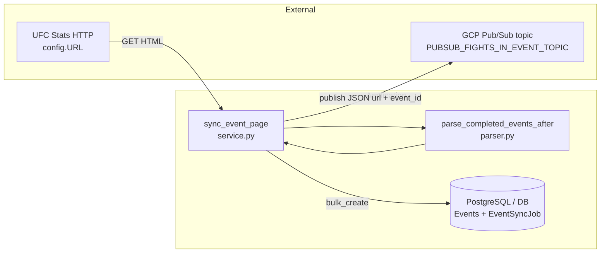

# Event page sync (`event_page_sync`)

This feature loads the UFC Stats **completed events** listing page, finds events newer than the latest `fantasy.Events` row (by `date`), inserts new `Events` rows, and **publishes one Pub/Sub message per new event** so downstream workers can scrape fights for that event. It also creates an `EventSyncJob` row for each run to record status and errors.

## Purpose

- Keep the local `Events` table aligned with the public completed-events list on UFC Stats.
- Kick off the fights-in-event pipeline by publishing messages consumed elsewhere in this repo (`fights_in_event` subscriber).

## Where This Lives

- Feature root: `backend/ufc_data_pipeline/events/event_page_sync/`
- Tests for the parser: `backend/ufc_data_pipeline/events/tests/test_parser.py`
- Related models: `backend/ufc_data_pipeline/models.py` (`EventSyncJob`), `backend/fantasy/models.py` (`Events`)
- Downstream consumer (reads messages this service publishes): `backend/ufc_data_pipeline/fights/fights_in_event/consumer.py`

## Main Files

- `config.py` — Defines the listing page URL constant `URL`.
- `parser.py` — Parses HTML with BeautifulSoup; exposes `parse_completed_events_after(soup, date)` and the `Event` dataclass (name, url, location, event_date).
- `service.py` — Orchestrates HTTP fetch, parsing, DB writes, retries, and Pub/Sub publish in `sync_event_page()`.
- `__init__.py` — Empty (no package-level exports in code).

## How It Works

- **Entry point (visible in this repo):** `sync_event_page()` in `service.py`. No other module in this repository imports or calls it (`Unknown from current code.` for schedulers, Cloud Functions, cron, or management commands).
- **Pub/Sub client:** Builds `PublisherClient` and `topic_path` from `GOOGLE_CLOUD_PROJECT` and `PUBSUB_FIGHTS_IN_EVENT_TOPIC` before creating the sync job row.
- **Job row:** Inserts `EventSyncJob` with `status=RUNNING`, `ran_at=now`, `retry_count=0`, empty `error_msg`.
- **Cutoff date:** Latest `Events.date` among rows with non-null `date`, ordered descending; if none, uses `datetime.date.min`.
- **Fetch:** `requests.get(URL, timeout=60)` then `raise_for_status()`.
- **Parse:** `parse_completed_events_after(soup, cutoff)` returns rows strictly **after** the cutoff calendar day.
- **Dedup:** Builds `existing_pairs` from DB for `(event, date)` among parsed dates; only creates rows not already present (matches `Events` unique constraint on `event` + `date`).
- **Persist:** `bulk_create` inside `transaction.atomic()`; on success sets job `COMPLETED` and `completed_at`.
- **Publish:** For each created `Events` instance, publishes JSON `{"url": ..., "event_id": ...}` to the topic named by `PUBSUB_FIGHTS_IN_EVENT_TOPIC` in project `GOOGLE_CLOUD_PROJECT`.
- **Retries:** Uses `tenacity.Retrying` with `stop_after_attempt(4)` and exponential backoff (`wait_exponential`, min 4s, max 15s). On each failure before the last attempt: `RETRYING`, increment `retry_count`, store `error_msg`, re-raise. On final failure: `FAILED`, save `error_msg`, re-raise.

## Data Flow

- **Input:** HTTP GET response body from `config.URL` (UFC Stats completed events HTML).
- **Processing:** BeautifulSoup → table rows → normalized `Event` rows → filter vs DB → `Events` bulk insert.
- **Output (database):** New rows in `fantasy_events` (Django model `Events`); updated row in `event_sync_job` (`EventSyncJob`).
- **Output (messaging):** One Pub/Sub publish per new `Events` row (same JSON shape the fights-in-event consumer parses).



## External Dependencies

- **HTTP:** `requests` to `http://ufcstats.com/statistics/events/completed?page=all` (see `config.py`; scheme is `http` in code).
- **HTML parsing:** `beautifulsoup4` (`BeautifulSoup`).
- **Django ORM:** `fantasy.models.Events`, `ufc_data_pipeline.models.EventSyncJob`, `transaction.atomic`, `timezone.now`.
- **GCP Pub/Sub:** `google.cloud.pubsub_v1.PublisherClient` — topic path `projects/{GOOGLE_CLOUD_PROJECT}/topics/{PUBSUB_FIGHTS_IN_EVENT_TOPIC}`.
- **Retries:** `tenacity` (`Retrying`, `stop_after_attempt`, `wait_exponential`).
- **Downstream in repo:** Messages are consumed by `fights_in_event.consumer` using `PUBSUB_FIGHTS_IN_EVENT_SUBSCRIPTION` (see that module’s docstring for payload contract).

## Environment Variables

Read at module load / runtime in `service.py`:

```text
GOOGLE_CLOUD_PROJECT   # GCP project id for Pub/Sub topic path
PUBSUB_FIGHTS_IN_EVENT_TOPIC   # Topic id (not full path) for fight-in-event jobs
```

Example names only — values are deployment-specific and not defined in this repository.

Downstream subscriber (not in this package but part of the same flow):

```text
PUBSUB_FIGHTS_IN_EVENT_SUBSCRIPTION
```

## How to Run Locally

- **Caller:** `Unknown from current code.` — nothing in this repository imports or calls `sync_event_page()`; only `service.py` defines it.
- **Running the full sync in this repo:** `Unknown from current code.` — no management command, URL route, or script in this tree wraps `sync_event_page()`.
- **Parser unit tests** (running pytest executes code — ask first if side effects matter in your environment):

```bash
cd backend
python -m pytest ufc_data_pipeline/events/tests/test_parser.py -q
```

Ask before running commands that start Django, touch a real database, or publish to Pub/Sub; those have side effects not covered by static analysis alone.

## Common Errors / Gotchas

- **Job stays `RUNNING` when nothing new is inserted:** If the HTTP fetch and parse succeed but `to_create` is empty, the function returns without updating the job to `COMPLETED` (that update only runs inside `if to_create:`).
- **Pub/Sub client at start:** `PublisherClient()` and `topic_path` are built before the try/retry loop; misconfiguration of `GOOGLE_CLOUD_PROJECT` or `PUBSUB_FIGHTS_IN_EVENT_TOPIC` can fail early.
- **Publish futures:** `publisher.publish(...)` return value is assigned to `future` but not awaited; delivery errors may surface only as client library behavior — not fully specified here.
- **URLs on messages:** Parser stores the link `href` from the listing (often a site-relative path). Downstream `requests.get(url)` behavior for relative URLs depends on that consumer and runtime config — verify end-to-end outside this doc.
- **Location length:** Service truncates `location` to 50 characters to match `Events.location` `max_length=50`.

## Notes for Future Developers

- Wire `sync_event_page()` to an explicit entry point (management command, scheduled job, etc.) if none exists outside this repo; until then, discovery is by reading `service.py` only.
- For HTML parsing behavior and selectors, rely on `parser.py` and `test_parser.py`; the live UFC Stats page layout can drift.
- If you add orchestration docs at repo level, keep **this** feature’s deep dive here under `event_page_sync/docs/` per project documentation rules.
