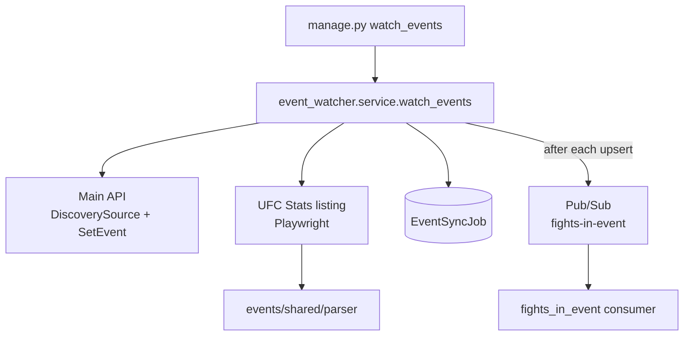

# Event Watcher (`event_watcher`)

Discovers new completed UFC events from the UFC Stats listing, upserts missing `Events` through the main API (not Django ORM), and publishes `{"url", "event_id"}` to `fights-in-event` for the Fights In Event Scraper. One `EventSyncJob` row tracks each `watch_events` run.

## Purpose

- Replace the retired combined ORM path (`event_page_sync` / `enqueue_event_sync`) with API-backed discovery and persistence.
- Hand off new events downstream via Pub/Sub without a separate Event Scraper or `event-scrape-jobs` topic.

## Where This Lives

- Feature root: `backend/ufc_data_pipeline/events/event_watcher/`
- Shared listing parser/config: `backend/ufc_data_pipeline/events/shared/`
- Management command: `backend/ufc_data_pipeline/management/commands/watch_events.py`
- Job model: `backend/ufc_data_pipeline/models.py` (`EventSyncJob`)
- Architecture: `backend/ufc_data_pipeline/instructions/ARCHITECTURE.md` (section 1. Event Watcher)

## Main Files

- `service.py` — Orchestrates discovery, identity comparison, upsert, publish, and `EventSyncJob` status.
- `api_client.py` — Pipeline-authenticated `GET /api/events/DiscoverySource` and `PATCH /api/events/SetEvent`.
- `scraper.py` — Playwright load of the completed-events listing → BeautifulSoup.
- `publisher.py` — Publishes `{"url", "event_id"}` to `PUBSUB_FIGHTS_IN_EVENT_TOPIC`.
- `config.py` — API base URL/key, Pub/Sub topic, Playwright timeouts, listing URL re-export from `events/shared`.

## How It Works

- **Entry point:** `python manage.py watch_events` → `watch_events()` in `service.py`.
- **Run tracking:** Creates `EventSyncJob` with status `RUNNING`; marks `COMPLETED` (including no work) or `FAILED` with `error_msg`.
- **Discovery:** `GET DiscoverySource` returns stored event identities; listing scrape uses shared `parse_completed_events`.
- **Identity compare:** Unknown if URL and `(name, date)` are both absent from the discovery snapshot; duplicate listing rows collapse before upsert.
- **Persist:** Each unknown event is upserted via `PATCH SetEvent` (URL match first, then name+date on the API side).
- **Publish:** After each successful upsert, `publish_fights_in_event(event_id, url)` sends one Pub/Sub message.
- **Failures:** Upsert or publish errors fail the job/command immediately. Partial progress is recorded in `error_msg` (`completing X of Y event(s); failed on url=...`). Retries rely on idempotent SetEvent + identity comparison (no outbox).

## Data Flow



- **Input:** Discovery API snapshot + completed-events HTML.
- **Output (database):** Upserted `Events` via API; one `EventSyncJob` per run.
- **Output (messaging):** Absolute event URL + `event_id` on `fights-in-event`.

## External Dependencies

- **Main API:** DiscoverySource and SetEvent (Api-Key auth).
- **UFC Stats:** Completed-events listing via Playwright/Chromium.
- **GCP Pub/Sub:** `publish_json` to `PUBSUB_FIGHTS_IN_EVENT_TOPIC`.
- **Shared parser:** `ufc_data_pipeline.events.shared.parser`.

## Environment Variables

Watcher / Pub/Sub:

```text
PIPELINE_API_BASE_URL
PIPELINE_SERVICE_API_KEY
GOOGLE_CLOUD_PROJECT
PUBSUB_FIGHTS_IN_EVENT_TOPIC
```

Django DB (required for `EventSyncJob` and process boot):

```text
DB_NAME
DB_USER
DB_PASSWORD
DB_HOST
DB_PORT
```

Local Compose examples commonly use:

```text
PIPELINE_API_BASE_URL=http://web:8000
GOOGLE_CLOUD_PROJECT=local-project
PUBSUB_FIGHTS_IN_EVENT_TOPIC=fights-in-event
PUBSUB_EMULATOR_HOST=pubsub:8085
```

There is no `PUBSUB_EVENT_SCRAPE_*` or `event-scraper-worker` for this stage. Do **not** set `PUBSUB_EMULATOR_HOST` in production.

## How to Run Locally

```bash
docker compose exec web python manage.py watch_events
```

Requires Django settings, DB, Playwright Chromium, pipeline API key, and Pub/Sub (emulator or GCP) for publish when unknown events exist.

**Tests:**

```bash
cd backend
python manage.py test ufc_data_pipeline.events.event_watcher.tests --keepdb
```

## Production scheduling (Cloud Scheduler → Cloud Run Job)

Packaging model (no in-repo Terraform for this slice):

```text
Cloud Scheduler
  → Cloud Run Job (existing backend image)
  → python manage.py watch_events
  → exit
```

### Command override

- Use the same backend image built from `backend/Dockerfile` (includes `playwright install --with-deps chromium`).
- Override the container command to one-shot discovery (do **not** leave the Compose/dev `runserver` default):

```bash
python manage.py watch_events
```

### Required runtime

| Concern | Expectation |
|---------|-------------|
| API auth | `PIPELINE_SERVICE_API_KEY` as `Authorization: Api-Key …`; `PIPELINE_API_BASE_URL` must reach the real API (not `http://web:8000`) |
| Pub/Sub | Job SA can **publish** to `PUBSUB_FIGHTS_IN_EVENT_TOPIC` (`fights-in-event` by default); payload `{"url", "event_id"}` |
| Scheduler | Scheduler SA can invoke/run the Cloud Run Job |
| Network | Outbound HTTPS/HTTP to UFC Stats listing + API; DB reachability for job rows |
| Chromium | Already baked in the image; rebuild if Playwright browsers are missing at runtime |
| Timeouts | Playwright listing load: 60s goto + 60s ready selector, up to 3 attempts; API HTTP: 60s. Set Cloud Run Job timeout ≥ listing scrape + N×(upsert + publish) for worst-case unknown-event bursts |
| Exit model | Exit **0** when `EventSyncJob` is `COMPLETED`, including **no unknown events**. Exit **non-zero** (`CommandError`) when the run fails so Cloud Run/Scheduler can retry |
| Retries | Each execution creates a **new** `EventSyncJob` (`retry_count=0`). Cloud Run/Scheduler owns retries; SetEvent is idempotent and identity comparison skips already-stored events |
| One-shot | No internal sleep loop; the command runs once and exits |

### URL normalization

- Listing hrefs may be relative or absolute. `normalize_event_url()` in `service.py` joins against `http://ufcstats.com` before identity comparison, upsert payload, and Pub/Sub publish.
- Live UFC Stats (verified 2026-07-18 via Playwright) currently emits absolute `http://ufcstats.com/event-details/...` hrefs; normalization remains required so fixtures and future relative hrefs stay safe.

### Listing selector contract (manual live check)

Verified against live `http://ufcstats.com/statistics/events/completed?page=all` with Playwright (plain HTTP returns a JS shell without table markup):

| Contract | Live result (2026-07-18) |
|----------|--------------------------|
| Row classes `b-statistics__table-row_type_first` / `b-statistics__table-row` | Present |
| Ready selector `.b-statistics__table-row` | Present |
| `span.b-statistics__date` (`%B %d, %Y`) | Present / parseable |
| `a.b-link.b-link_style_black` (fallback white) | Present |
| Location `td.b-statistics__table-col.b-statistics__table-col_style_big-top-padding` | Present |
| Shared `parse_completed_events` | Parsed **781** events |

Event-detail page selectors are **not** required for Event persistence (listing fields are enough). No selector drift blocking cutover as of this check.

### Out of scope for this packaging slice

- Checking in Cloud Scheduler / Cloud Run Terraform (follow-up if product expands scope).
- Rename-repair, outbox, fights-in-event consumer idempotency hardening (called out as later follow-ups, not accidental omissions).

## Common Errors / Gotchas

- Missing `PIPELINE_API_BASE_URL` / `PIPELINE_SERVICE_API_KEY` → `RuntimeError` from `api_client`.
- Listing/API/parser failures mark `EventSyncJob` `FAILED` and raise `CommandError` from the management command.
- Publish failure after a successful upsert still fails the run; retry is safe because SetEvent is idempotent.
- Must not write `fantasy.Events` through Django ORM from this package.
- Fetching the listing with plain `requests`/`urllib` without a browser may return a shell page with no row markup; production uses Playwright.

## Notes for Future Developers

- Listing fields (name, date, location, URL) are enough to persist an Event; do not add an Event Scraper or detail-page scrape for Event persistence.
- Shared listing code stays under `events/shared/`; do not reintroduce `events/event_page_sync/`.
- Downstream fight discovery remains `fights_in_event` (see its feature doc).
- Re-run the live selector check if UFC Stats markup drifts; update `events/shared/` fixtures/parser, not event-detail scrapers.
