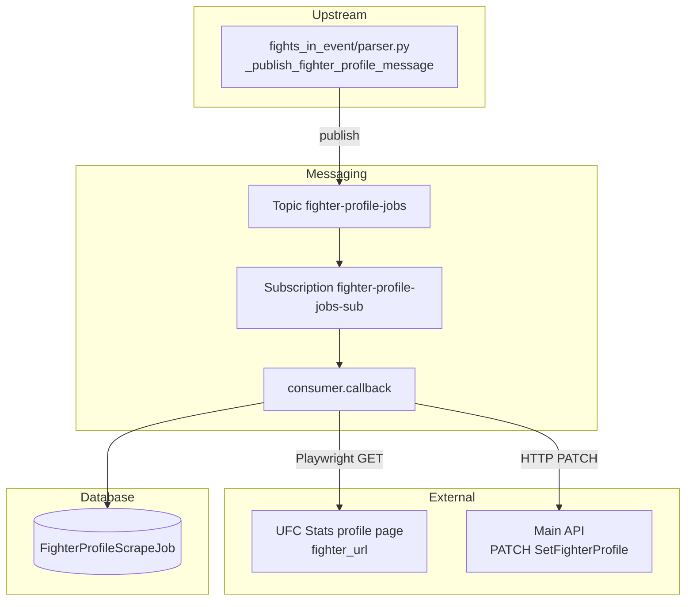

# Fighter profile scraper (`fighter_profile`)

This feature consumes **Pub/Sub** messages for UFC Stats **fighter profile** pages, loads each page with Playwright, parses tale-of-the-tape metadata, updates **`Fighters`** through the main API service, and records each run in **`FighterProfileScrapeJob`**.

Upstream publisher: `backend/ufc_data_pipeline/fights/fights_in_event/parser.py` via `_publish_fighter_profile_message` (publish only — no job rows created upstream).

## Purpose

- Scrape fighter profile metadata (name, nickname, height, weight, reach, stance, DOB).
- Persist profile updates through `PATCH /api/fighters/<fighter_id>/SetFighterProfile`.
- Track job status in `fighter_profile_scrape_job` (`RUNNING`, `COMPLETED`, `RETRYING`, `FAILED`).

## Where This Lives

- Feature root: `backend/ufc_data_pipeline/fighters/fighter_profile/`
- Job model: `backend/ufc_data_pipeline/models.py` (`FighterProfileScrapeJob`)
- Upstream publisher: `backend/ufc_data_pipeline/fights/fights_in_event/parser.py`
- Related developer doc: `backend/ufc_data_pipeline/fights/fights_in_event/docs/fights-in-event.md`

## Main Files

- `fighter_profile_worker.py` — process entry point; signal handling and consumer bootstrap.
- `consumer.py` — Pub/Sub subscriber, `_get_or_create_job` lifecycle, ack/nack rules, idle shutdown.
- `service.py` — Playwright fetch, parser invocation, API client call.
- `parser.py` — BeautifulSoup parsing for UFC Stats profile pages.
- `api_client.py` — HTTP PATCH to the main API service.
- `config.py` — topic/subscription names, timeouts, API base URL, Playwright selector.
- `tests/test_parser.py` — parser unit tests.
- `tests/test_consumer.py` — consumer callback and job lifecycle tests.

## How It Works

- **Primary entry point:** `fighter_profile_worker.main()` → `run_subscriber()` in `consumer.py`.
- **Django bootstrap:** `ensure_django()` sets `DJANGO_SETTINGS_MODULE` to `ufc_fantasy.settings` before DB use.
- **Subscription:** `SubscriberClient.subscribe(subscription_path, callback=callback)` on `projects/local-project/subscriptions/fighter-profile-jobs-sub` (names from `config.py`).
- **Idle shutdown:** Controlled by `WORKER_IDLE_SHUTDOWN_ENABLED` / `WORKER_IDLE_TIMEOUT_SECONDS` (via `worker_settings`). When enabled, the outer loop exits after the idle timeout with no messages. Compose sets shutdown **disabled** for local development.
- **Per-message `callback`:**
  - Parses JSON → `fighter_id` (int) and `fighter_url` (non-empty string). Bad payloads are **acked** (dropped).
  - `_get_or_create_job(fighter_id, fighter_url)`:
    - If a **`RUNNING`** job already exists for the fighter → return `None`, **ack** (skip duplicate in-flight work).
    - If a **`RETRYING`** job exists → promote it to `RUNNING`, update `profile_url`, return that row.
    - Otherwise (including when a prior **`COMPLETED`** or **`FAILED`** job exists) → create a **new** `RUNNING` job row.
  - `process_fighter_profile` → Playwright page load → `parse_fighter_profile` → `PATCH` via API.
  - Success → job `COMPLETED`, set `completed_at` → **ack**.
  - Failure → increment `retry_count`; if `retry_count >= MAX_RETRY_COUNT` (3) → `FAILED` and **ack**; else `RETRYING` and **nack** (redelivery).

## Parser behavior (`parser.py`)

Name fields are taken from the **current fighter's profile page**, not from bout or event links elsewhere on the page.

| Field | Source | Rule |
|-------|--------|------|
| `full_name` | `span.b-content__title-highlight` | Full display name (e.g. `"Song Yadong"`) |
| `first_name` | Derived from `full_name` | First word |
| `last_name` | Derived from `full_name` | Remaining words joined |
| `nick_name` | `.b-content__Nickname` | Nickname text |
| Height, weight, reach, stance, DOB | First `ul.b-list__box-list` (tale of the tape) | Label/value parsing |

Do **not** use `a.b-link.b-link_style_black` for name fields — those links can point at opponents, events, or other related pages.

Playwright waits for `span.b-content__title-highlight` (`PROFILE_PAGE_READY_SELECTOR` in `config.py`) before parsing.

## Data Flow

- **Input:** Pub/Sub message bytes: JSON `{"fighter_id": <int>, "fighter_url": "<profile URL>"}`.
- **Processing:** Playwright Chromium → BeautifulSoup → API PATCH payload.
- **Output (database):** `fighter_profile_scrape_job` row updates; fighter metadata updated via API (not direct ORM write from this worker).
- **Output (HTTP):** `PATCH /api/fighters/<fighter_id>/SetFighterProfile` with API key auth.



## External Dependencies

- **Playwright:** Chromium browser (installed in `backend/Dockerfile` via `playwright install --with-deps chromium`).
- **HTML parsing:** `beautifulsoup4`.
- **HTTP client:** `requests` in `api_client.py`.
- **Django ORM:** `FighterProfileScrapeJob`, transactions, timezone.
- **GCP Pub/Sub:** `google.cloud.pubsub_v1.SubscriberClient`.

## Environment Variables

```text
PUBSUB_EMULATOR_HOST              # localhost:8085 on host; pubsub:8085 inside docker-compose
GOOGLE_CLOUD_PROJECT              # default local-project
PUBSUB_FIGHTER_PROFILE_TOPIC
PUBSUB_FIGHTER_PROFILE_SUBSCRIPTION
PIPELINE_API_BASE_URL             # http://web:8000 in Compose; http://localhost:8000 on host
PIPELINE_SERVICE_API_KEY
WORKER_IDLE_SHUTDOWN_ENABLED      # Compose sets false for local workers
WORKER_IDLE_TIMEOUT_SECONDS       # default 60
WORKER_IDLE_CHECK_INTERVAL_SECONDS
```

**Docker Compose overrides for `fighter-profile-worker`:**

```text
PUBSUB_EMULATOR_HOST=pubsub:8085
PIPELINE_API_BASE_URL=http://web:8000
WORKER_IDLE_SHUTDOWN_ENABLED=false
```

## How to Run Locally

**Enqueue a test job (preferred):**

```bash
docker compose exec web python manage.py enqueue_fighter_profile \
  --fighter-id 1 \
  --fighter-url 'http://ufcstats.com/fighter-details/...'
```

**Docker Compose worker:**

```bash
docker compose up --build
```

Requires `pubsub`, `pubsub-init`, and `web` services.

## Common Errors / Gotchas

- **Wrong `PUBSUB_EMULATOR_HOST` in Docker:** If the worker uses `localhost:8085` inside a container, it will not reach the emulator. Use `pubsub:8085` via docker-compose `environment` overrides.
- **Playwright browser missing:** Run `playwright install --with-deps chromium` during the Docker image build (`backend/Dockerfile`). Rebuild the image if you see `Executable doesn't exist at .../ms-playwright/chromium...`.
- **Re-scraping completed fighters:** A prior `COMPLETED` job does **not** block a new scrape; a new job row is created. Only an in-flight `RUNNING` job causes a skip.
- **Invalid JSON or empty `fighter_url`:** Payload errors are **acked**; the message is dropped.

## Notes for Future Developers

- Ack/nack must be called from the subscriber `callback` thread.
- Upstream `fights_in_event` publishes to Pub/Sub only; it does not create `FighterProfileScrapeJob` rows.
- Unit tests: `tests/test_parser.py`, `tests/test_consumer.py`.
