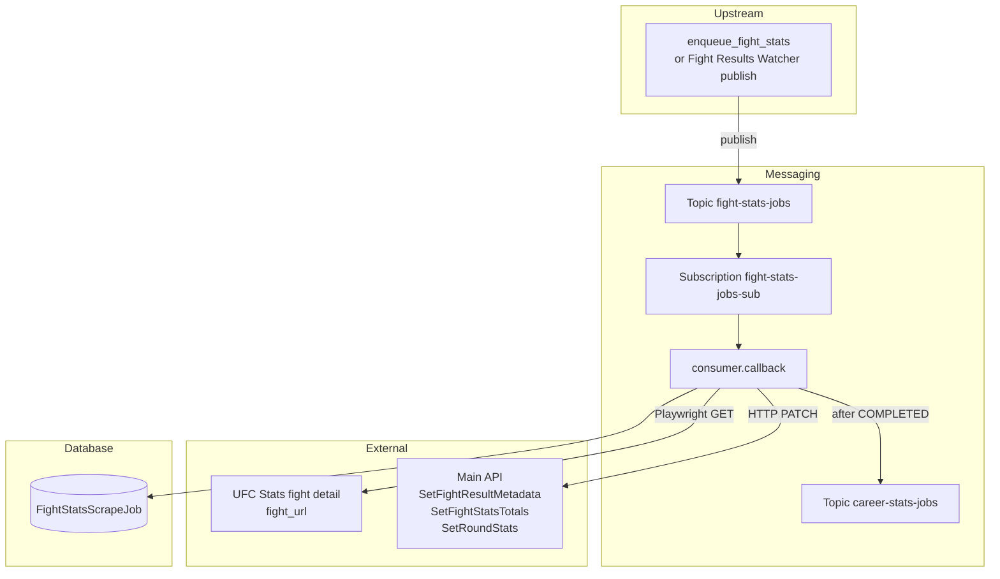

# Fight stats scraper (`fight_stats`)

This feature consumes **Pub/Sub** messages for UFC Stats **fight detail** pages, loads each page with Playwright, parses fight metadata plus per-fighter totals and round stats, upserts fantasy data through the main API service, records each run in **`FightStatsScrapeJob`**, and publishes a downstream **`career-stats-jobs`** message after success.

Upstream is expected to **publish only** (Fight Results Watcher, not yet implemented). Local testing uses `enqueue_fight_stats` without that watcher.

## Purpose

- Scrape completed-fight detail pages (method, round, time, W/L, strike/grappling totals, per-round stats).
- Persist updates through three API endpoints (metadata, FightStats totals, RoundStats).
- Track job status in `fight_stats_scrape_job` (`RUNNING`, `COMPLETED`, `RETRYING`, `FAILED`).
- Hand off to career stats via Pub/Sub after a successful scrape.

## Where This Lives

- Feature root: `backend/ufc_data_pipeline/fights/fight_stats/`
- Job model: `backend/ufc_data_pipeline/models.py` (`FightStatsScrapeJob`)
- API endpoints: `backend/api/urls.py` / `backend/api/views.py`
- Local enqueue command: `backend/fantasy/management/commands/enqueue_fight_stats.py`
- Compose worker: `fight-stats-worker` in `docker-compose.yml`

## Main Files

- `fight_stats_worker.py` — process entry point; signal handling and consumer bootstrap.
- `consumer.py` — Pub/Sub subscriber, `_get_or_create_job` lifecycle, ack/nack rules, idle shutdown, career-stats publish after COMPLETED.
- `service.py` — Playwright fetch, parser invocation, API client calls, `publish_career_stats_job`.
- `parser.py` — BeautifulSoup parsing for UFC Stats fight detail pages (pure; no I/O).
- `api_client.py` — authenticated HTTP PATCH calls to the main API service.
- `config.py` — topic/subscription names, timeouts, API base URL, Playwright selector, `MAX_MESSAGES`.
- `tests/` — parser, consumer, idle shutdown, and career-stats publish tests.

## How It Works

- **Primary entry point:** `fight_stats_worker.main()` → `run_subscriber()` in `consumer.py`.
- **Django bootstrap:** `ensure_django()` sets `DJANGO_SETTINGS_MODULE` to `ufc_fantasy.settings` before DB use.
- **Subscription:** `SubscriberClient.subscribe(..., flow_control=FlowControl(max_messages=MAX_MESSAGES))` on `fight-stats-jobs-sub` (names from `config.py`). Default concurrency is 3 (`WORKER_MAX_MESSAGES`).
- **Idle shutdown:** Controlled by `WORKER_IDLE_SHUTDOWN_ENABLED` / `WORKER_IDLE_TIMEOUT_SECONDS` (via `worker_settings`). Compose sets shutdown **disabled** for local development.
- **Per-message `callback`:**
  - Parses JSON → `fight_id` (int) and `fight_url` (non-empty string). Bad payloads are **acked** (dropped).
  - `_get_or_create_job(fight_id, fight_url)` inside `transaction.atomic()` + `select_for_update()`:
    - If a **`RUNNING`** job already exists for the fight → return `None`, **ack** (skip duplicate in-flight work).
    - If a **`RETRYING`** job exists → promote it to `RUNNING`, update `fight_url`, return that row.
    - Otherwise (including when a prior **`COMPLETED`** or **`FAILED`** job exists) → create a **new** `RUNNING` job row.
  - `process_fight_stats` → Playwright page load → `parse_fight_page` → three API PATCHes.
  - Success → job `COMPLETED` (atomic) → `publish_career_stats_job(fight_id)` **after** that commit → **ack**.
  - Failure → increment `retry_count`; if `retry_count >= MAX_RETRY_COUNT` (3) → `FAILED` and **ack**; else `RETRYING` and **nack**.

## Pub/Sub contract

**Inbound** (`fight-stats-jobs` / `fight-stats-jobs-sub`):

```json
{"fight_id": 9350, "fight_url": "http://ufcstats.com/fight-details/..."}
```

**Outbound** (`career-stats-jobs`), published only after the job row is `COMPLETED`:

```json
{"fight_id": 9350}
```

## API endpoints used

| Step | Method / path | Effect |
|------|---------------|--------|
| 1 | `PATCH /api/fights/<fight_id>/SetFightResultMetadata` | Updates `Fights` result metadata |
| 2 | `PATCH /api/fights/<fight_id>/SetFightStatsTotals` | Upserts **two** `FightStats` rows (one per fighter) |
| 3 | `PATCH /api/fights/<fight_id>/SetRoundStats` | Upserts `RoundStats` per fighter per round |

Auth: `Authorization: Api-Key <PIPELINE_SERVICE_API_KEY>` (`HasAPIKey` / `IsPipelineService` on the views).

The worker does **not** write fantasy tables via ORM; only `FightStatsScrapeJob` is pipeline-owned ORM state.

## Data Flow

- **Input:** Pub/Sub message bytes with `fight_id` + `fight_url`.
- **Processing:** Playwright Chromium → BeautifulSoup → API PATCH payloads.
- **Output (database):** `fight_stats_scrape_job` row updates; fantasy `Fights` / `FightStats` / `RoundStats` via API.
- **Output (messaging):** publish `{"fight_id": ...}` to `career-stats-jobs` after COMPLETED.



## External Dependencies

- **Playwright:** Chromium (`backend/Dockerfile` installs via `playwright install --with-deps chromium`).
- **HTML parsing:** `beautifulsoup4`.
- **HTTP client:** `requests` in `api_client.py`.
- **Django ORM:** `FightStatsScrapeJob` only (pipeline job table).
- **GCP Pub/Sub:** subscriber + `publish_json` for career-stats handoff.

## Environment Variables

```text
PUBSUB_EMULATOR_HOST              # localhost:8085 on host; pubsub:8085 inside docker-compose
GOOGLE_CLOUD_PROJECT              # default local-project
PUBSUB_FIGHT_STATS_TOPIC          # default fight-stats-jobs
PUBSUB_FIGHT_STATS_SUBSCRIPTION   # default fight-stats-jobs-sub
PUBSUB_CAREER_STATS_TOPIC         # default career-stats-jobs
PIPELINE_API_BASE_URL             # http://web:8000 in Compose
PIPELINE_SERVICE_API_KEY
WORKER_IDLE_SHUTDOWN_ENABLED      # Compose sets false for local workers
WORKER_IDLE_TIMEOUT_SECONDS       # default 60
WORKER_IDLE_CHECK_INTERVAL_SECONDS
WORKER_MAX_MESSAGES               # default 3; concurrent Pub/Sub callbacks per worker
```

**Docker Compose overrides for `fight-stats-worker`:**

```text
PUBSUB_EMULATOR_HOST=pubsub:8085
PIPELINE_API_BASE_URL=http://web:8000
WORKER_IDLE_SHUTDOWN_ENABLED=false
WORKER_MAX_MESSAGES=3
```

## How to Run Locally

**Start worker (and dependencies):**

```bash
docker compose up --build fight-stats-worker
```

`depends_on` waits for `pubsub-init` to finish creating topics/subscriptions and for `web` to start.

**Enqueue a test job (no Fight Results Watcher required):**

```bash
docker compose exec web python manage.py enqueue_fight_stats \
  --fight-id 1 \
  --fight-url 'http://ufcstats.com/fight-details/...'
```

**Confirm success:**

- Worker logs: `Started fight stats job...`, `Completed API updates...`, `Published career-stats job...`
- Job row `fight_stats_scrape_job` status `COMPLETED` for that `fight_id`
- Fantasy tables updated via the three API endpoints (check `web` access logs for paired PATCHes)
- Optional: pull `career-stats-jobs-sub` on the emulator to see `{"fight_id": ...}`

## Common Errors / Gotchas

- **Wrong `PUBSUB_EMULATOR_HOST` in Docker:** Inside a container, `localhost:8085` does not reach the emulator. Use `pubsub:8085` (Compose override).
- **Missing `PIPELINE_SERVICE_API_KEY`:** `api_client` raises `PIPELINE_SERVICE_API_KEY is not configured`.
- **Playwright browser missing:** Rebuild the backend image so Chromium is installed.
- **Duplicate in-flight scrapes:** Same-`fight_id` concurrency is blocked by `select_for_update` job claims; different fights can run up to `WORKER_MAX_MESSAGES` at once.
- **Re-scraping completed fights:** A prior `COMPLETED` job does **not** block a new scrape; a new job row is created. Only an in-flight `RUNNING` job causes a skip.
- **Invalid JSON or empty `fight_url`:** Payload errors are **acked**; the message is dropped.
- **Career-stats publish timing:** Publish runs **after** the job `COMPLETED` commit, not inside that atomic block.

## Notes for Future Developers

- Ack/nack must be called from the subscriber `callback` thread.
- Persistence is API-only for fantasy tables; do not add direct ORM writes to `Fights` / `FightStats` / `RoundStats` from this worker.
- Career Stats Worker is out of scope; this stage only publishes `{"fight_id": ...}`.
- Upstream Fight Results Watcher should **publish** to `fight-stats-jobs` only — it must not create `FightStatsScrapeJob` rows.
