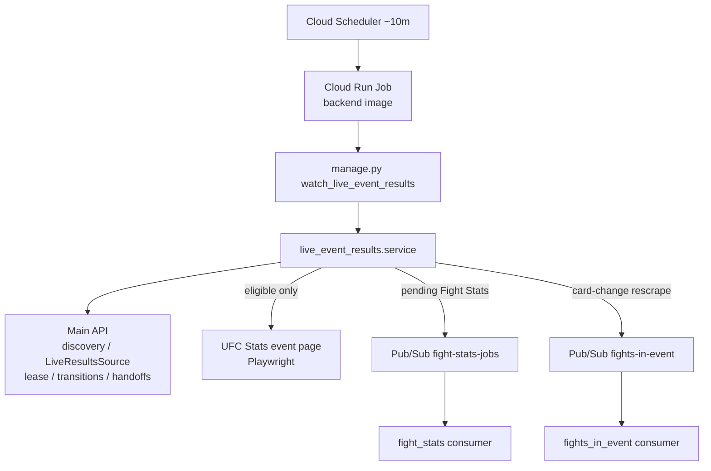

# Live Event Results Watcher (`live_event_results`)

One-shot scheduled watcher that detects live UFC Stats event-page result changes for the newest stored event, persists status transitions through pipeline-authenticated APIs, publishes durable Fight Stats and Fights In Event rescrape handoffs, and exits. It replaces the separate planned DB Event Watcher and Fight Results Watcher.

## Purpose

- Run as Cloud Scheduler → Cloud Run Job → existing backend image → `watch_live_event_results` → exit (no permanent poll loop).
- Reconcile stored fights against one UFC Stats event-page fetch for today/yesterday events.
- Drain durable pending Fight Stats and rescrape publications even after the event ages out of the date window.
- Never write fantasy/domain tables or watcher state through Django ORM; never create Fight rows; never scrape full fight-detail stats.

## Where This Lives

- Feature root: `backend/ufc_data_pipeline/fights/live_event_results/`
- Management command: `backend/ufc_data_pipeline/management/commands/watch_live_event_results.py`
- Shared publishers: `backend/ufc_data_pipeline/shared/fight_stats_publisher.py`, `backend/ufc_data_pipeline/shared/fights_in_event_publisher.py`
- Shared event-row parser: `backend/ufc_data_pipeline/fights/shared/event_page_fights.py`
- Architecture: `backend/ufc_data_pipeline/instructions/ARCHITECTURE.md` (Live Event Results Watcher)

## Main Files

- `service.py` — Orchestrates date gate, lease claim/renew/complete/fail, card compare, transitions, handoff drain, and outcomes.
- `api_client.py` — Pipeline-authenticated discovery, LiveResultsSource, lease, transition, and handoff APIs.
- `retry.py` — Bounded retry classification, exponential backoff + jitter, bounded `Retry-After`.
- `matcher.py` — Pure stored-vs-scraped card comparison by normalized fight URL.
- `fingerprint.py` — Card fingerprint and rescrape reason helpers.
- `scraper.py` — Playwright fetch of the UFC Stats event page.
- `date_gate.py` — Required IANA timezone + today/yesterday eligibility.
- `config.py` — Env-backed API, lease, retry, and rescrape settings.

## How It Works

- **Entry point:** `python manage.py watch_live_event_results` → `watch_live_event_results()` in `service.py`.
- **Startup guards:** Missing/invalid `LIVE_EVENT_RESULTS_TIMEZONE` fails before work. Empty `PIPELINE_API_BASE_URL` / `PIPELINE_SERVICE_API_KEY` fail before discovery.
- **Selection:** `GET` discovery → newest stored event. No event → successful `no_event`.
- **Date gate:** Eligible when event date is local today or yesterday in the configured timezone.
- **Pending bypass:** Unresolved Fight Stats (`PENDING`) or rescrape (`PENDING` / `PUBLISHED` / `FAILED`) handoffs claim a lease and drain even when date-ineligible (`pending_without_scrape`). No UFC Stats fetch on that path.
- **Terminal:** No upcoming fights and no unresolved handoffs → claim, complete lease, exit `terminal` without scraping.
- **Active lease:** Another owner with an unexpired lease → successful `active_lease_skip`.
- **Eligible scrape path:** Claim lease → one Playwright event-page fetch → renew → parse rows → compare card → cancel / restore / complete transitions → rescrape ensure/publish → drain Fight Stats handoffs → complete lease (warnings) or fail lease + raise.
- **Card cancellation alone** does not fail the run. **Completed-vs-upcoming regression** is a durable warning, not a failure.
- **Owner-token loss** (`LeaseOwnerLostError`) stops further mutation for that run.
- **Partial success:** After prerequisites succeed, per-fight/handoff failures are aggregated; successful side effects remain; exhausted failures produce a nonzero command exit (`CommandError`).

## Data Flow



- **Input:** Discovery + LiveResultsSource snapshot; optionally one UFC Stats event HTML page.
- **Output (API):** Fight status transitions, lease/run state, Fight Stats handoff markers, rescrape handoff state.
- **Output (messaging):** Unchanged `{"fight_id", "fight_url"}` on `fight-stats-jobs`; unchanged required `{"url", "event_id"}` on `fights-in-event` (optional `reason` / `fingerprint` metadata).

## External Dependencies

- **Main API:** Pipeline Api-Key auth for discovery, snapshot, lease, transitions, handoffs.
- **UFC Stats:** Event detail page via Playwright/Chromium (eligible runs only).
- **GCP Pub/Sub:** `publish_fight_stats_job` and `publish_fights_in_event` (existing topics).
- **Shared parser:** `parse_event_fight_rows` from `fights/shared/event_page_fights.py`.

## Environment Variables

Watcher-specific:

```text
LIVE_EVENT_RESULTS_TIMEZONE=America/New_York
LIVE_EVENT_RESULTS_LEASE_SECONDS=900
LIVE_EVENT_RESULTS_RETRY_MAX_ATTEMPTS=3
LIVE_EVENT_RESULTS_RETRY_BACKOFF_BASE_S=1
LIVE_EVENT_RESULTS_RETRY_BACKOFF_CAP_S=8
LIVE_EVENT_RESULTS_RETRY_JITTER_RATIO=0.25
LIVE_EVENT_RESULTS_RETRY_AFTER_MAX_S=30
LIVE_EVENT_RESULTS_RESCRAPE_COOLDOWN_SECONDS=1800
LIVE_EVENT_RESULTS_RESCRAPE_MAX_PUBLICATIONS=3
```

Shared pipeline / Pub/Sub (reuse existing):

```text
PIPELINE_API_BASE_URL
PIPELINE_SERVICE_API_KEY
GOOGLE_CLOUD_PROJECT
PUBSUB_FIGHT_STATS_TOPIC
PUBSUB_FIGHTS_IN_EVENT_TOPIC
```

Django DB vars are still required to boot `manage.py` (same as other pipeline commands). Do **not** set `PUBSUB_EMULATOR_HOST` in production.

Example values also live in repo-root `.env.example`.

## How to Run Locally

One-shot against Compose (side effects: API + optional Pub/Sub + UFC Stats):

```bash
docker compose exec web python manage.py watch_live_event_results
```

Requires `LIVE_EVENT_RESULTS_TIMEZONE`, pipeline API key/base URL, Chromium in the image, and Pub/Sub (emulator or GCP) when handoffs publish.

### Fixture-driven verification (no live external side effects)

Prefer the unit/integration suite. It uses mocks/fakes and in-memory HTML fragments (shared parser tests) rather than live UFC Stats or Pub/Sub:

```bash
cd backend
$env:SUPABASE_URL="http://localhost"
$env:SUPABASE_KEY="test-key"
python manage.py test ufc_data_pipeline.fights.live_event_results.tests --settings=ufc_fantasy.test_settings
```

Also covered without this package’s network I/O:

```bash
python manage.py test ufc_data_pipeline.fights.shared.tests.test_event_page_fights --settings=ufc_fantasy.test_settings
```

Documented fixture-style scenarios in those tests include: no-event / date-ineligible / active-lease skip / terminal / aged pending drain / cancellation / completion handoffs / replacement rescrape / retry classification.

## Production scheduling (Cloud Scheduler → Cloud Run Job)

Packaging model (**deployment infrastructure-as-code is not included** in this repository):

```text
Cloud Scheduler (every 10 minutes)
  → Cloud Run Job (existing backend image from backend/Dockerfile)
  → python manage.py watch_live_event_results
  → exit
```

### Command override

- Use the same backend image as other pipeline jobs (`playwright install --with-deps chromium` is already in `backend/Dockerfile`).
- Override the container command (do **not** leave Compose `runserver`):

```bash
python manage.py watch_live_event_results
```

### Operator checklist

| Concern | Expectation |
|---------|-------------|
| Schedule | Cloud Scheduler every **10 minutes** |
| Command override | `python manage.py watch_live_event_results` |
| Timeout budget | Cloud Run Job timeout ≥ Playwright event fetch (60s goto + ready) + retries (~3× backoff) + per-fight API/publish work; lease default is 15 minutes rolling |
| Service account | Scheduler can run the Job; Job SA can reach the API and DB |
| API access | `PIPELINE_SERVICE_API_KEY` as `Authorization: Api-Key …`; `PIPELINE_API_BASE_URL` must reach the real API (not `http://web:8000`) |
| Pub/Sub publisher IAM | Job SA can **publish** to `PUBSUB_FIGHT_STATS_TOPIC` and `PUBSUB_FIGHTS_IN_EVENT_TOPIC` |
| UFC Stats egress | Outbound HTTPS/HTTP to `ufcstats.com` event pages |
| Chromium / runtime | Chromium baked into the image; rebuild if browsers are missing |
| Timezone | Valid IANA `LIVE_EVENT_RESULTS_TIMEZONE` (required; no silent default) |
| Exit model | Exit **0** on successful outcomes including no-work / date-ineligible / active-lease skip / terminal / card-compared. Exit **non-zero** (`CommandError`) on aggregated item failures or prerequisite failures |
| Retries | In-command: max 3 attempts, exp backoff ~1/2/4s + jitter, bounded `Retry-After`. Scheduler owns the next 10-minute attempt for durable pending work |
| One-shot | No internal sleep/poll/subscriber loop |

### Out of scope for this packaging slice

- Checking in Cloud Scheduler / Cloud Run Terraform or other deployment IaC.
- Operator UI for watcher state.
- Creating replacement fights inside this watcher.

## Operator guidance

| Situation | Behavior / action |
|-----------|-------------------|
| Active-lease skip | Overlap with another unexpired owner; exit success. Wait for next schedule or lease expiry (~15 min default). |
| Expiry recovery | Crashed job’s lease becomes reclaimable after `locked_until`; next schedule claims normally. |
| Pending Fight Stats | Handoff stays `PENDING` until publish+mark succeed; aged events still drain without scraping. |
| Rescrape cooldown | Same card fingerprint suppressed for `LIVE_EVENT_RESULTS_RESCRAPE_COOLDOWN_SECONDS` (default 1800). New fingerprint is immediately eligible. |
| Rescrape exhaustion | After `RESCRAPE_MAX_PUBLICATIONS` (default 3) cooldown-separated publishes, handoff is `FAILED` with operator-action error; automatic republication stops. Repair card/API data manually, then clear/resolve durable state through API/ops process. |
| Partial failed run | Some fights may have committed; lease failed with durable error; command nonzero. Next schedule continues remaining pending work. |
| Completed-vs-upcoming warning | Durable warning on lease complete; run still success. |
| Cancellation only | Success; no Fight Stats publish for cancelled bouts. |
| No-winner completed | Remains completed and still gets a Fight Stats handoff. |

## Observability

Structured logs use the `live_event_results` prefix and include (as applicable): `outcome`, `event_id`, `fight_id`, `operation`, `attempt`, `elapsed_ms`, transition labels, handoff status/id, rescrape `fingerprint` / `reason`, and lease `owner_token_suffix` only (never full credentials or `PIPELINE_SERVICE_API_KEY`).

## Common Errors / Gotchas

- Missing timezone → `TimezoneConfigError` before discovery.
- Missing API base URL/key → `PermanentError` before discovery.
- Fetch/API/publish exhaustion after prerequisites → fail lease best-effort, raise; recoverable via lease expiry + durable pending markers.
- Playwright without Chromium → rebuild backend image.
- Must not write fantasy fights/events/watcher tables via ORM from this package.
- Must not start containers or run a permanent polling worker from this command.

## Notes for Future Developers

- Pub/Sub contracts for Fight Stats and Fights In Event remain the consumer-facing source of truth; this watcher is an additional producer only.
- Fights In Event remains the only owner of Fight creation and full card upsert for replacements.
- Fight Stats remains the only owner of fight-detail scrape and `FightStatsScrapeJob` rows.
- Prefer extending pipeline APIs over adding ORM access here.
